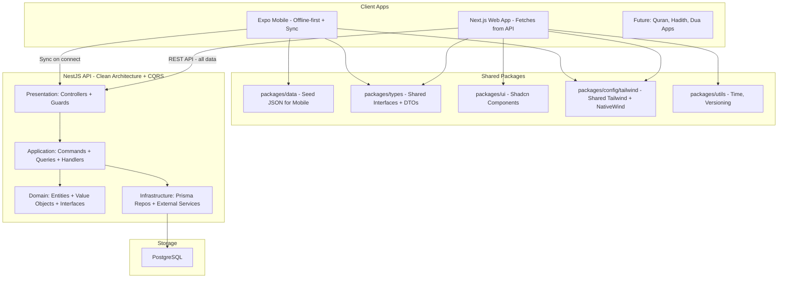
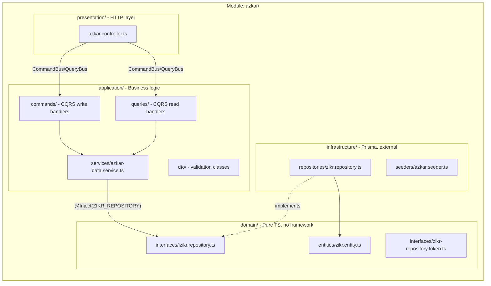
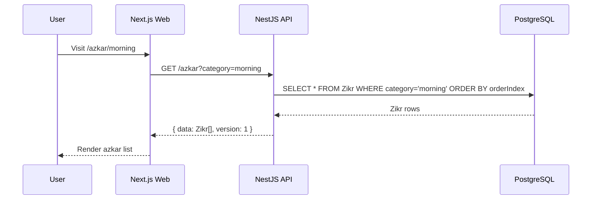
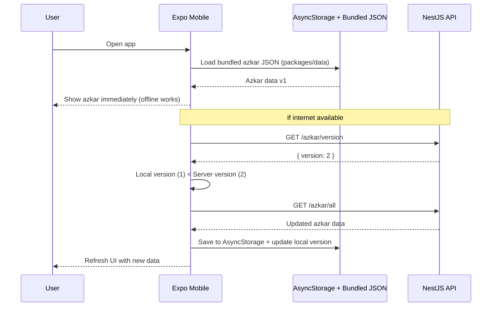
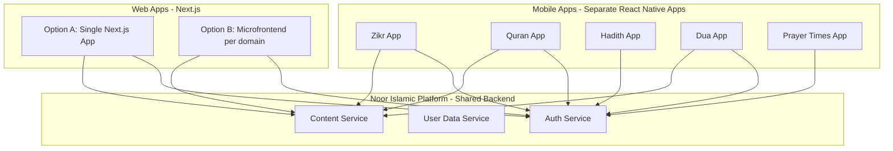

# Zikr App - Full Implementation Plan (v2)

> **Vision**: Zikr is the first app in a family of Islamic apps. All apps share the same NestJS backend, auth system, and design system. Each app is a separate React Native app or Next.js app (or modules in a microfrontend). The backend is designed from day one to be extended with new domains (Quran, Hadith, Prayer Times, Dua, etc.).

---

## Architecture Overview



---

## Key Technical Decisions

- **Backend Architecture**: Clean Architecture + CQRS pattern (NestJS `@nestjs/cqrs`)
- **Repository Pattern**: Domain interfaces in `domain/`, Prisma implementations in `infrastructure/`
- **Auth**: Email/Password + Google/Apple OAuth (via Passport.js)
- **Database**: PostgreSQL with Prisma 7 ORM (`@prisma/adapter-pg` + `pg.Pool`)
- **Web data flow**: Next.js fetches ALL azkar data from NestJS API (no hardcoded data on web)
- **Mobile data flow**: Ships with local JSON from `packages/data`; on app start + internet, checks API for updated version; syncs if newer
- **Content versioning**: Azkar data has a `version` number in DB; mobile caches version locally and only re-fetches when server version is newer
- **Shared Tailwind**: Single Tailwind config in `packages/config/tailwind`, consumed by Next.js (native) and Expo (via NativeWind v4)
- **Strapi CMS**: Deferred to future phase (blog/articles content only)
- **Scaling**: Backend designed as domain modules that can be extracted into microservices later

---

## Design Identity

> **Style**: Inspired by the Golden Quran app. Warm, luxurious, gold-dominant. Dark mode feels like reading at night -- rich dark warm browns with gold accents. Light mode is clean cream/white with gold highlights.

### Color Palette -- Gold Primary

- **Gold (Primary)**: Full 10-shade scale from cream to deep brown
  - `#FFFBEB` (50) -> `#FEF3C7` (100) -> `#FDE68A` (200) -> `#FCD34D` (300)
  - `#FBBF24` (400) -> `#F59E0B` (500, main) -> `#D97706` (600) -> `#B45309` (700)
  - `#92400E` (800) -> `#78350F` (900) -> `#451A03` (950, deepest)
- **Dark mode backgrounds** (warm-tinted, not cold gray):
  - Base: `#0D0B08` (near-black warm), Card: `#1A1510`, Elevated: `#262015`, Surface: `#332B1E`
- **Light mode backgrounds** (warm cream):
  - Base: `#FFFBF5` (warm cream), Card: `#FFFFFF`, Surface: `#FEF8F0`
- **Text**:
  - Dark mode: `#FDE68A` (gold-200) for Arabic, `#B45309` (gold-700) for secondary
  - Light mode: `#1C1917` for body, `#78350F` (gold-900) for headings

### Design Tokens (Tailwind)

```javascript
// packages/config/tailwind/design-tokens.js
module.exports = {
  colors: {
    gold: {
      50: "#FFFBEB",
      100: "#FEF3C7",
      200: "#FDE68A",
      300: "#FCD34D",
      400: "#FBBF24",
      500: "#F59E0B",
      600: "#D97706",
      700: "#B45309",
      800: "#92400E",
      900: "#78350F",
      950: "#451A03",
    },
    dark: {
      base: "#0D0B08",
      card: "#1A1510",
      elevated: "#262015",
      surface: "#332B1E",
    },
    light: {
      base: "#FFFBF5",
      card: "#FFFFFF",
      surface: "#FEF8F0",
    },
  },
  borderRadius: {
    sm: "6px",
    DEFAULT: "12px",
    lg: "16px",
    xl: "24px",
    full: "9999px",
  },
  fontFamily: {
    tajawal: ["Tajawal", "sans-serif"],
  },
  fontSize: {
    "zikr-xl": ["32px", { lineHeight: "1.5", fontWeight: "700" }],
    "zikr-lg": ["24px", { lineHeight: "1.5", fontWeight: "600" }],
    body: ["16px", { lineHeight: "1.6", fontWeight: "400" }],
    caption: ["12px", { lineHeight: "1.4", fontWeight: "400" }],
  },
};
```

### Font: Tajawal

- **Package**: `@fontsource/tajawal` (self-hosted, no Google Fonts dependency)
- **Weights used**: 400 (body), 500 (medium), 700 (headings/zikr), 800 (counter numbers)
- **Subsets**: Arabic + Latin -- one font for both languages
- **Next.js**: Import via `next/font/google` with `subsets: ['arabic', 'latin']`
- **React Native**: Bundle via `expo-font`
- Replaces Cairo font throughout the app

### Background Texture (Islamic Geometric Pattern)

The app background uses a subtle Islamic arabesque geometric pattern (interlocking stars and lines, like traditional mashrabiya screens):

- **Asset**: `packages/ui/src/assets/patterns/arabesque.svg` -- a single repeating geometric tile
- **Light mode**: Gold-100 (`#FEF3C7`) pattern at 30% opacity over `#FFFBF5` base
- **Dark mode**: Gold-700 (`#B45309`) pattern at 15% opacity over `#0D0B08` base
- **Applied via**: Tailwind `bg-[url('/patterns/arabesque.svg')]` on page containers
- Cards sit on top of the texture with solid backgrounds (white / dark-card)

### Repeat Count Badge: 8-Pointed Islamic Star

The repeat count for each zikr (e.g., 3) is displayed inside a small **8-pointed Islamic star (octagram)** in gold:

- **Component**: `packages/ui/src/components/ui/star-badge.tsx`
- **SVG**: 8-pointed star shape, `w-8 h-8` (32px), `fill-gold-500`, number centered in `text-dark-base font-tajawal font-bold text-sm`
- **Dark mode**: `fill-gold-500` star, `text-dark-base` number
- **Light mode**: `fill-gold-500` star, `text-white` number
- Used on every zikr card and in the detail view

### Counter Mode (User Preference)

Users can choose how they interact with zikr repeat counts in **Settings**:

- **Interactive (default)**: A circular tap counter appears on the zikr detail view. User taps to count each repetition (1/3, 2/3, 3/3). Auto-completes when target reached. Gold ring progress indicator.
- **Display Only**: No tap counter. Shows the count as text ("Read it 3 times" / "اقرأها ٣ مرات"). User reads independently and taps **"Next"** button to mark complete and move to the next zikr. On the **last zikr** in the category, the button changes to **"Back to Home"** / **"العودة للرئيسية"** which marks it complete and returns to the main dashboard.

This preference is stored in `UserPreferences.counterMode: 'interactive' | 'display'` (default: `'interactive'`).

### Component Style Rules (Golden Quran Aesthetic)

- **Cards**: `rounded-xl` (12px), `border border-gold-200 dark:border-gold-800/30`, `bg-white dark:bg-dark-card`, generous `p-5`, subtle gold top-border accent, sit on textured background
- **Buttons**: `rounded-xl` (12px), `bg-gold-500 text-dark-base` primary, `h-12` touch target
- **Star badge**: 8-pointed SVG star, `w-8 h-8`, gold-500 fill, dark number inside
- **Counter circle**: `rounded-full`, gold-500 stroke on dark-base background, 200px diameter, gold ring progress
- **Bottom nav**: `bg-dark-card` with gold-500 active icon, gold-700 inactive icons, `rounded-t-2xl`
- **Arabic text**: Always `font-tajawal text-zikr-xl` (32px), `text-right` or `text-center`, `dark:text-gold-200`
- **Spacing**: Minimum `p-4` for all containers, `gap-3` between list items
- **Shadows**: Light mode warm shadow `shadow-[0_2px_8px_rgba(180,83,9,0.08)]`; dark mode uses subtle gold borders instead
- **Dividers**: Thin `border-gold-200` in light mode, `border-gold-800/30` in dark mode

---

## Shared Tailwind Setup: `packages/config/tailwind`

### How It Works

Single tailwind config shared between Next.js and React Native (NativeWind v4):

```
packages/config/tailwind/
  design-tokens.js       -- Colors, radius, fonts, spacing
  tailwind.preset.js     -- Tailwind preset extending tokens
  index.js               -- Re-exports preset
```

**Next.js** (`apps/web/tailwind.config.ts`):

```typescript
import sharedPreset from "@repo/config/tailwind";
export default {
  presets: [sharedPreset],
  content: ["./src/**/*.{ts,tsx}", "../../packages/ui/**/*.{ts,tsx}"],
};
```

**React Native** (`apps/mobile/tailwind.config.js`) -- via NativeWind v4:

```javascript
const sharedPreset = require("@repo/config/tailwind");
module.exports = {
  presets: [sharedPreset],
  content: ["./src/**/*.{ts,tsx}", "../../packages/ui/**/*.{ts,tsx}"],
};
```

NativeWind v4 compiles Tailwind classes to React Native StyleSheet at build time. Same class names work on both platforms. Platform-specific overrides use `web:` and `native:` variants.

---

## Phase 1: Foundation and Data (Days 1-2)

### 1.1 Shared Types - `packages/types/src/`

Add to existing package:

- `packages/types/src/zikr.ts` -- Zikr, CounterPreset, CategoryProgress, DailyProgress, CounterState
- `packages/types/src/auth.ts` -- RegisterDto, LoginDto, AuthTokens, UserProfile
- `packages/types/src/preferences.ts` -- UserPreferences
- `packages/types/src/api.ts` -- ApiResponse, PaginatedResponse, VersionedContent
- `packages/types/src/index.ts` -- Re-export all

### 1.2 Seed Data Package - `packages/data/`

This package serves TWO purposes:

1. **Seed the database**: NestJS API uses this data to seed the Zikr table on first run
2. **Mobile offline fallback**: Mobile app bundles this JSON as the default dataset

```
packages/data/
  src/
    azkar/morning.json    -- ~15 morning azkar
    azkar/evening.json    -- ~15 evening azkar
    azkar/night.json      -- ~10 night azkar
    counter/presets.json   -- Counter presets
    version.ts            -- export const DATA_VERSION = 1;
    index.ts              -- Re-exports with types
  package.json            -- @repo/data
```

Each azkar item shape (JSON, consumed by both API seeder and mobile):

```typescript
{
  id: number,
  arabicText: string,        // WITH full tashkeel (e.g., "سُبْحَانَ اللَّهِ وَبِحَمْدِهِ")
  arabicTextClean?: string,  // Optional: without tashkeel for search/matching
  translation: { ar?: string, en: string },
  transliteration?: string,
  repeatCount: number,
  reference?: string,
  virtue?: { ar?: string, en?: string },
  category: "morning" | "evening" | "night",
  order: number
}
```

**Tashkeel Policy**: All Arabic zikr text, Quran verses, and dua text MUST include full diacritical marks (fatha, kasra, damma, sukun, shadda, tanween) for correct recitation. General Arabic UI labels (navigation, buttons, settings) do NOT need tashkeel.

### 1.3 Shared Tailwind Config - `packages/config/tailwind/`

- `design-tokens.js` -- Colors (gold primary, warm dark/light backgrounds, neutrals), border-radius, font sizes, spacing
- `tailwind.preset.js` -- Tailwind preset using tokens
- Update `apps/web/tailwind.config.ts` to use shared preset

### 1.4 Shared UI Components - `packages/ui/src/components/ui/`

Add Shadcn/ui components via CLI (currently only Button exists):
Card, Badge, Progress, Tabs, Dialog, Sheet, Toggle, ScrollArea, Separator, Avatar, Input, Label

### 1.5 Utilities - `packages/utils/src/`

- `time.ts` -- `getCurrentTimePeriod()`, `getGreeting()`
- `version.ts` -- `shouldUpdate(localVersion, serverVersion)` helper
- Update `index.ts` to re-export

### 1.6 i18n Messages

Update `apps/web/messages/ar.json` and `apps/web/messages/en.json` with all new UI strings.

---

## Phase 2: NestJS API - Clean Architecture + CQRS (Days 3-6)

### 2.1 Prisma 7 Setup

Prisma 7 uses the new `prisma-client` generator with driver adapters. Output goes to `src/generated/prisma`.

**Schema config** (`apps/api/prisma/schema.prisma`):

```prisma
generator client {
  provider     = "prisma-client"
  output       = "../src/generated/prisma"
  moduleFormat = "cjs"
}

datasource db {
  provider = "postgresql"
  url      = env("DATABASE_URL")
}
```

**PrismaService** (`apps/api/src/prisma/prisma.service.ts`) -- uses `@prisma/adapter-pg` with connection pooling:

```typescript
import { Injectable, OnModuleInit, OnModuleDestroy } from "@nestjs/common";
import { PrismaClient } from "../generated/prisma/client";
import { PrismaPg } from "@prisma/adapter-pg";
import pg from "pg";

@Injectable()
export class PrismaService extends PrismaClient implements OnModuleInit, OnModuleDestroy {
  private pool: pg.Pool;

  constructor() {
    const pool = new pg.Pool({ connectionString: process.env.DATABASE_URL });
    const adapter = new PrismaPg(pool);
    super({ adapter });
    this.pool = pool;
  }

  async onModuleInit() { await this.$connect(); }
  async onModuleDestroy() { await this.$disconnect(); await this.pool.end(); }
}
```

**PrismaModule** (`apps/api/src/prisma/prisma.module.ts`) -- global:

```typescript
@Global()
@Module({ providers: [PrismaService], exports: [PrismaService] })
export class PrismaModule {}
```

**Dependencies**: `prisma` (dev), `@prisma/client`, `@prisma/adapter-pg`, `pg`, `@types/pg`

### 2.2 Shared Repository Base (from eduo-plus pattern)

Located in `apps/api/src/shared/repositories/`:

**IRepository** (`irepository.interface.ts`):

```typescript
export interface IRepository {
  findUnique<T = unknown>(args: unknown): Promise<T | null>;
  findFirst<T = unknown>(args: unknown): Promise<T | null>;
  findMany<T = unknown>(args: unknown): Promise<T[]>;
  create<T = unknown>(args: unknown): Promise<T>;
  update<T = unknown>(args: unknown): Promise<T>;
  delete<T = unknown>(args: unknown): Promise<T>;
  upsert<T = unknown>(args: unknown): Promise<T>;
  count(args: unknown): Promise<number>;
  updateMany(args: unknown): Promise<unknown>;
  deleteMany(args: unknown): Promise<unknown>;
}
```

**PrismaRepository\<T\>** (`prisma.repository.ts`) -- abstract base, all module repos extend this:

```typescript
@Injectable()
export abstract class PrismaRepository<T = unknown> implements IRepository {
  constructor(protected readonly prisma: PrismaService) {}
  protected abstract getDelegate(): PrismaModelDelegate<T>;
  // All CRUD methods delegate to getDelegate()
  // Helpers: findOne(id), findAll(), findAllByIds(ids), exists(id)
}
```

### 2.3 Clean Architecture + Repository Pattern Per Module

Each module combines Clean Architecture 4-layer separation with the eduo-plus repository pattern:



**Layer rules**:

- `domain/` -- Pure TypeScript. Entities, repository interfaces (contracts), DI tokens. NO framework imports, NO Prisma.
- `application/` -- CQRS commands/queries/handlers, data services, DTOs. Injects domain interfaces via tokens.
- `infrastructure/` -- Prisma repository implementations, seeders, external API clients. Only layer that knows about Prisma.
- `presentation/` -- Controllers. Only talks to `CommandBus` / `QueryBus`. No business logic.

**Domain layer** (contracts -- no framework deps):

```typescript
// modules/azkar/domain/interfaces/zikr-repository.token.ts
export const ZIKR_REPOSITORY = Symbol("ZIKR_REPOSITORY");

// modules/azkar/domain/interfaces/izikr.repository.ts
export interface IZikrRepository extends PrismaRepository<Zikr> {}

// modules/azkar/domain/entities/zikr.entity.ts
export interface ZikrEntity {
  id: number;
  arabicText: string;
  arabicTextClean?: string;
  translationEn?: string;
  translationAr?: string;
  transliteration?: string;
  repeatCount: number;
  reference?: string;
  category: string;
  orderIndex: number;
  version: number;
}
```

**Infrastructure layer** (Prisma implementation):

```typescript
// modules/azkar/infrastructure/repositories/zikr.repository.ts
@Injectable()
export class ZikrRepository extends PrismaRepository<ZikrModel> implements IZikrRepository {
  constructor(prisma: PrismaService) { super(prisma); }
  protected getDelegate() { return this.prisma.zikr; }
}
```

**Application layer** (data service + CQRS handlers):

```typescript
// modules/azkar/application/services/azkar-data.service.ts
@Injectable()
export class AzkarDataService {
  constructor(@Inject(ZIKR_REPOSITORY) private readonly zikrRepository: IZikrRepository) {}

  async getByCategory(category: string) {
    return this.zikrRepository.findMany({ where: { category }, orderBy: { orderIndex: "asc" } });
  }
  async getAll() { return this.zikrRepository.findMany({ orderBy: { orderIndex: "asc" } }); }
  async getById(id: number) { return this.zikrRepository.findUnique({ where: { id } }); }
}
```

**Module registration**:

```typescript
@Module({
  providers: [
    ZikrRepository,
    { provide: ZIKR_REPOSITORY, useExisting: ZikrRepository },
    AzkarDataService,
    SeedAzkarHandler, GetAzkarByCategoryHandler, GetAzkarVersionHandler, GetCounterPresetsHandler,
  ],
  controllers: [AzkarController],
  exports: [AzkarDataService],
})
export class AzkarModule {}
```

### 2.4 CQRS Pattern (Commands + Queries)

**Command** (write) -- handlers inject DataService, not repos directly:

```typescript
// modules/auth/application/commands/register.handler.ts
@CommandHandler(RegisterCommand)
export class RegisterHandler implements ICommandHandler<RegisterCommand> {
  constructor(private readonly authData: AuthDataService) {}
  async execute(command: RegisterCommand): Promise<AuthTokens> {
    const existing = await this.authData.findUserByEmail(command.email);
    if (existing) throw new ConflictException("Email already registered");
    const hash = await bcrypt.hash(command.password, 12);
    const user = await this.authData.createUser({ ...command, passwordHash: hash });
    return this.authData.issueTokens(user);
  }
}
```

**Query** (read):

```typescript
@QueryHandler(GetCurrentUserQuery)
export class GetCurrentUserHandler implements IQueryHandler<GetCurrentUserQuery> {
  constructor(private readonly authData: AuthDataService) {}
  async execute(query: GetCurrentUserQuery): Promise<UserProfile> {
    return this.authData.findUserById(query.userId);
  }
}
```

**Controller** (presentation -- only talks to CommandBus/QueryBus):

```typescript
@Controller("auth")
export class AuthController {
  constructor(private readonly commandBus: CommandBus, private readonly queryBus: QueryBus) {}

  @Post("register")
  register(@Body() dto: RegisterDto) {
    return this.commandBus.execute(new RegisterCommand(dto.email, dto.password, dto.name));
  }

  @Get("me") @UseGuards(JwtAuthGuard)
  me(@CurrentUser() userId: string) {
    return this.queryBus.execute(new GetCurrentUserQuery(userId));
  }
}
```

### 2.5 Full API Directory Structure

```
apps/api/src/
  generated/prisma/                -- Prisma 7 generated client (gitignored)

  prisma/
    prisma.module.ts               -- Global PrismaModule
    prisma.service.ts              -- PrismaClient + PrismaPg adapter + pg.Pool

  shared/
    repositories/
      irepository.interface.ts     -- Base IRepository interface
      prisma.repository.ts         -- Abstract PrismaRepository<T>

  common/
    decorators/current-user.decorator.ts
    guards/jwt-auth.guard.ts
    guards/optional-auth.guard.ts
    interceptors/response.interceptor.ts
    filters/http-exception.filter.ts

  modules/
    auth/                            -- Auth Domain
      domain/
        entities/user.entity.ts
        interfaces/iuser.repository.ts
        interfaces/user-repository.token.ts
      application/
        commands/register.command.ts + handler
        commands/login.command.ts + handler
        commands/refresh-token.command.ts + handler
        commands/social-login.command.ts + handler
        queries/get-current-user.query.ts + handler
        services/auth-data.service.ts
        dto/register.dto.ts, login.dto.ts, social-login.dto.ts
      infrastructure/
        repositories/user.repository.ts
        strategies/jwt.strategy.ts, google.strategy.ts, apple.strategy.ts
      presentation/auth.controller.ts
      auth.module.ts

    azkar/                           -- Azkar Content Domain
      domain/
        entities/zikr.entity.ts, counter-preset.entity.ts
        interfaces/izikr.repository.ts, zikr-repository.token.ts
      application/
        commands/seed-azkar.command.ts + handler
        queries/get-azkar-by-category.query.ts + handler
        queries/get-azkar-version.query.ts + handler
        queries/get-counter-presets.query.ts + handler
        services/azkar-data.service.ts
      infrastructure/
        repositories/zikr.repository.ts
        seeders/azkar.seeder.ts
      presentation/azkar.controller.ts
      azkar.module.ts

    progress/                        -- Progress Domain
      domain/
        entities/daily-progress.entity.ts, streak.entity.ts
        interfaces/iprogress.repository.ts, progress-repository.token.ts
      application/
        commands/upsert-progress + handler, update-streak + handler
        queries/get-daily-progress + handler, get-streak + handler
        services/progress-data.service.ts
      infrastructure/repositories/progress.repository.ts
      presentation/progress.controller.ts
      progress.module.ts

    counter/                         -- Counter Domain
      domain/entities/ + interfaces/
      application/commands/ + queries/ + services/counter-data.service.ts
      infrastructure/repositories/counter.repository.ts
      presentation/counter.controller.ts
      counter.module.ts

    favorites/                       -- Favorites Domain
      domain/ + application/ + infrastructure/ + presentation/
      favorites.module.ts

    preferences/                     -- Preferences Domain
      domain/ + application/ + infrastructure/ + presentation/
      preferences.module.ts
```

### 2.6 Database Schema (Prisma 7)

```prisma
generator client {
  provider     = "prisma-client"
  output       = "../src/generated/prisma"
  moduleFormat = "cjs"
}

datasource db {
  provider = "postgresql"
  url      = env("DATABASE_URL")
}

model User {
  id            String    @id @default(cuid())
  email         String?   @unique
  passwordHash  String?
  name          String?
  provider      String    @default("local")
  providerId    String?
  avatarUrl     String?
  createdAt     DateTime  @default(now())
  updatedAt     DateTime  @updatedAt
  preferences   UserPreferences?
  progress      DailyProgress[]
  counterState  CounterState?
  favorites     Favorite[]
  streak        Streak?
  refreshTokens RefreshToken[]
}

model RefreshToken {
  id        String   @id @default(cuid())
  userId    String
  user      User     @relation(fields: [userId], references: [id], onDelete: Cascade)
  token     String   @unique
  expiresAt DateTime
  createdAt DateTime @default(now())
}

model UserPreferences {
  id               String  @id @default(cuid())
  userId           String  @unique
  user             User    @relation(fields: [userId], references: [id], onDelete: Cascade)
  language         String  @default("ar")
  theme            String  @default("system")
  counterMode      String  @default("interactive")
  soundEnabled     Boolean @default(true)
  vibrationEnabled Boolean @default(true)
}

model Zikr {
  id               Int     @id @default(autoincrement())
  arabicText       String  // WITH full tashkeel
  arabicTextClean  String? // Without tashkeel (for search)
  translationEn    String?
  translationAr    String?
  transliteration  String?
  repeatCount      Int     @default(1)
  reference        String?
  virtueAr         String?
  virtueEn         String?
  category         String
  orderIndex       Int
  version          Int     @default(1)
  createdAt        DateTime @default(now())
  updatedAt        DateTime @updatedAt
  @@index([category, orderIndex])
}

model CounterPreset {
  id          String @id @default(cuid())
  labelAr     String
  labelEn     String
  targetCount Int
  orderIndex  Int
  version     Int    @default(1)
}

model ContentVersion {
  id        String   @id @default(cuid())
  key       String   @unique
  version   Int      @default(1)
  updatedAt DateTime @updatedAt
}

model DailyProgress {
  id           String   @id @default(cuid())
  userId       String
  user         User     @relation(fields: [userId], references: [id], onDelete: Cascade)
  date         String
  category     String
  completedIds String
  inProgress   String
  createdAt    DateTime @default(now())
  updatedAt    DateTime @updatedAt
  @@unique([userId, date, category])
}

model CounterState {
  id          String  @id @default(cuid())
  userId      String  @unique
  user        User    @relation(fields: [userId], references: [id], onDelete: Cascade)
  current     Int     @default(0)
  target      Int     @default(33)
  presetId    String?
  customLabel String?
}

model Favorite {
  id     String @id @default(cuid())
  userId String
  user   User   @relation(fields: [userId], references: [id], onDelete: Cascade)
  zikrId Int
  @@unique([userId, zikrId])
}

model Streak {
  id       String @id @default(cuid())
  userId   String @unique
  user     User   @relation(fields: [userId], references: [id], onDelete: Cascade)
  count    Int    @default(0)
  lastDate String
}
```

### 2.7 API Endpoints Summary

**Auth** (`/auth`):
- `POST /auth/register` -- Email + password registration
- `POST /auth/login` -- Returns access_token + refresh_token
- `POST /auth/refresh` -- Exchange refresh_token
- `POST /auth/google` -- Google ID token exchange
- `POST /auth/apple` -- Apple auth code exchange
- `GET /auth/me` -- Current user profile (protected)

**Azkar** (`/azkar`) -- public, no auth required:
- `GET /azkar?category=morning` -- Get azkar by category
- `GET /azkar/version` -- Get current content version number
- `GET /azkar/all` -- Get all azkar (for mobile bulk sync)
- `GET /counter-presets` -- Get counter presets

**Progress** (`/progress`) -- protected:
- `GET /progress?date=2026-02-11` -- Get daily progress
- `PUT /progress` -- Upsert category progress
- `GET /progress/streak` -- Get streak

**Counter** (`/counter`) -- protected:
- `GET /counter` -- Get counter state
- `PUT /counter` -- Save counter state

**Favorites** (`/favorites`) -- protected:
- `GET /favorites` -- List favorites
- `POST /favorites/:zikrId` -- Add favorite
- `DELETE /favorites/:zikrId` -- Remove favorite

**Preferences** (`/preferences`) -- protected:
- `GET /preferences` -- Get preferences
- `PATCH /preferences` -- Update preferences

### 2.8 DB Seeder

On first `pnpm dev` of the API, the `AzkarSeeder` runs:
1. Check if `Zikr` table is empty
2. If empty, import data from `@repo/data` and insert all azkar + counter presets
3. Create initial `ContentVersion` record with version = 1

---

## Phase 3: Core Web App - Home and Azkar (Days 7-9)

### Data Flow: Web App



- Server-side rendering (SSR) via Next.js server components for initial load
- Client-side fetch for progress, counter, favorites (needs auth token)

### 3.1 Layout and Navigation

- Modify `apps/web/src/app/[locale]/layout.tsx` -- add AuthProvider, QueryClientProvider, bottom nav
- Create `apps/web/src/components/bottom-nav.tsx` -- 4 tabs: Home, Counter, Favorites, Settings

### 3.2 API Client - `apps/web/src/lib/api-client.ts`

Typed API client for NestJS with all endpoint methods.

### 3.3 Hooks

- `use-auth.ts`, `use-azkar.ts`, `use-time-period.ts`, `use-progress.ts`, `use-counter.ts`, `use-favorites.ts`, `use-streak.ts`, `use-preferences.ts`
- Sync strategy: localStorage for instant UX + API calls in background

### 3.4 Home Page -- time-based greeting, streak, period cards, counter card
### 3.5 Azkar List Page -- SSR fetch, tabs, progress bar, zikr cards
### 3.6 Zikr Detail Page -- Arabic text, translation, tap-to-count / display-only, favorite
### 3.7 Key Components -- ZikrCard, PeriodCard, ProgressHeader, StreakBadge, ZikrCounter, BottomNav, AuthDialog

---

## Phase 4: Counter, Favorites, Settings, Auth (Days 10-11)

### 4.1 Tasbih Counter Page -- presets, circular counter, tap to count, persist
### 4.2 Favorites Page -- bookmarked azkar, empty state
### 4.3 Settings Page -- language, theme, **counter mode (interactive/display)**, sound, vibration, account, reset
### 4.4 Auth Pages -- login, register, Google + Apple social, AuthDialog modal

---

## Phase 5: Polish and PWA (Days 12-13)

- Animations (completion checkmark, counter bounce, page transitions)
- Responsive design (mobile-first 375px, tablet 768px, desktop 1024px)
- Dark mode pass with design tokens
- RTL testing
- PWA: `manifest.json`, service worker, offline cache, install prompt

---

## Phase 6: Mobile App - Offline-First (Days 14-17)

### Data Flow: Mobile App



### Mobile Setup

- **NativeWind v4**: Same Tailwind classes as web, compiled to RN StyleSheet
- **React Navigation**: Tab navigator (Home, Counter, Favorites, Settings)
- **AsyncStorage**: Persists azkar cache, progress, preferences
- **Bundled JSON**: `packages/data` JSON files included in app bundle as fallback
- **Network check**: `@react-native-community/netinfo` for connectivity detection
- **Haptic feedback**: `expo-haptics` for counter taps

---

## Scaling Plan: Islamic App Platform

### Vision

Zikr is the **seed app**. The monorepo and backend are designed to grow into a family of Islamic apps:



### Scaling Stages

**Stage 1 (Now) -- Zikr App**: Single NestJS monolith, single Next.js web, single Expo mobile. All in one monorepo.

**Stage 2 -- Add New Domains (3-6 months)**: Add NestJS modules (quran/, hadith/, dua/, prayer-times/). Same backend, same auth, same DB.

**Stage 3 -- Separate Mobile Apps (6-12 months)**: Create `mobile-quran/`, `mobile-hadith/`, etc. Each shares packages but has own Expo config.

**Stage 4 -- Microservices (12+ months)**: Extract domain modules into separate services (api-gateway, api-auth, api-content, api-user). Message queues for inter-service communication.

**Stage 5 -- Web Microfrontend (optional)**: Split web into shell + micro-apps via Module Federation.

### What to Build Now for Scalability

- **Clean Architecture**: Domain logic decoupled from framework -- easy to extract into microservices
- **CQRS**: Commands/queries can be routed to different services later
- **Repository interfaces**: Swap Prisma for any other data source without touching business logic
- **Shared packages**: `@repo/types`, `@repo/ui`, `@repo/config`, `@repo/utils`, `@repo/data`
- **Domain modules**: Each NestJS module is self-contained and can become a microservice
- **Content versioning**: Mobile apps already know how to check for updates
- **Auth as standalone module**: Same JWT tokens work across all apps

---

## File Structure Summary (All New/Modified Files)

```
packages/
  config/tailwind/                 [NEW] Shared Tailwind config
    design-tokens.js
    tailwind.preset.js
    index.js

  data/                            [NEW PACKAGE] Seed data
    src/azkar/morning.json
    src/azkar/evening.json
    src/azkar/night.json
    src/counter/presets.json
    src/version.ts
    src/index.ts
    package.json, tsconfig.json

  types/src/
    zikr.ts                        [NEW]
    auth.ts                        [NEW]
    preferences.ts                 [NEW]
    api.ts                         [NEW]
    index.ts                       [MODIFY]

  utils/src/
    time.ts                        [NEW]
    version.ts                     [NEW]
    index.ts                       [MODIFY]

  ui/src/
    assets/patterns/arabesque.svg    [NEW] Islamic geometric background pattern
    components/ui/
      card.tsx, badge.tsx, progress.tsx, tabs.tsx,
      dialog.tsx, sheet.tsx, toggle.tsx, scroll-area.tsx,
      separator.tsx, avatar.tsx, input.tsx, label.tsx  [NEW - Shadcn CLI]
      star-badge.tsx                   [NEW] 8-pointed star repeat count badge

apps/api/
  prisma/schema.prisma             [NEW] Prisma 7 schema
  src/
    generated/prisma/              [GENERATED] Prisma 7 client (gitignored)
    prisma/                        [NEW] PrismaService (adapter-pg + pool) + PrismaModule
    shared/repositories/           [NEW] IRepository + PrismaRepository<T> base
    common/                        [NEW] Guards, interceptors, filters, decorators
    modules/                       [NEW] Clean Architecture + CQRS
      auth/                        domain/ application/ infrastructure/ presentation/
      azkar/                       domain/ application/ infrastructure/ presentation/
      progress/                    domain/ application/ infrastructure/ presentation/
      counter/                     domain/ application/ infrastructure/ presentation/
      favorites/                   domain/ application/ infrastructure/ presentation/
      preferences/                 domain/ application/ infrastructure/ presentation/

apps/web/
  tailwind.config.ts               [MODIFY] Use shared preset
  src/
    lib/api-client.ts              [NEW] Typed API client
    hooks/                         [NEW] 8 hooks
    components/                    [NEW] 7+ components
    app/[locale]/
      page.tsx                     [MODIFY] Home page
      layout.tsx                   [MODIFY] Nav + providers
      azkar/[category]/page.tsx    [NEW]
      azkar/[category]/[id]/page.tsx [NEW]
      counter/page.tsx             [NEW]
      favorites/page.tsx           [NEW]
      settings/page.tsx            [NEW]
      auth/login/page.tsx          [NEW]
      auth/register/page.tsx       [NEW]
    messages/ar.json               [MODIFY]
    messages/en.json               [MODIFY]

apps/mobile/ (Phase 6)
  tailwind.config.js               [NEW] NativeWind using shared preset
  src/
    navigation/                    [NEW] React Navigation tabs
    screens/                       [NEW] All screens
    hooks/                         [NEW] Offline-first hooks
    services/sync.ts               [NEW] Version check + data sync
```
