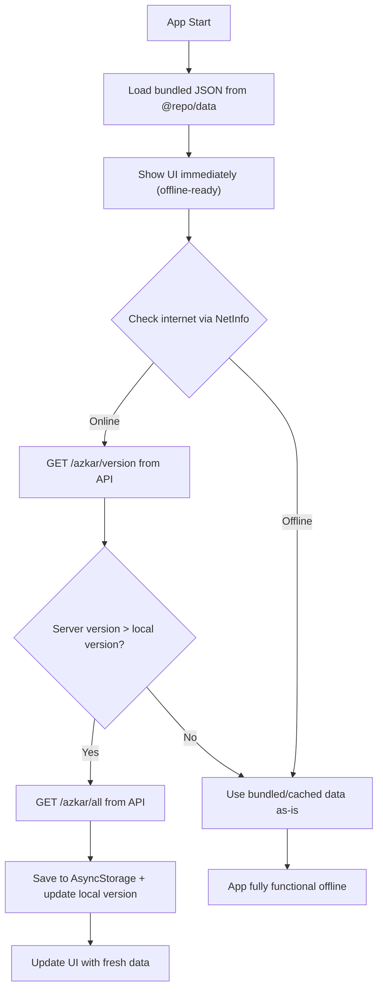

# Zikr Mobile App — Expo/React Native Implementation Plan

> **Stack**: Expo ~50.0.0 · React Native 0.73 · NativeWind v4 · React Navigation 6 · AsyncStorage · expo-haptics · expo-font · TanStack Query · Offline-first with bundled JSON + API sync
>
> **Phase**: 6 of overall project (built after API + Web are complete)
>
> **Shared packages**: `@repo/types`, `@repo/data`, `@repo/utils`, `@repo/config` (Tailwind preset)

---

## Data Flow: Offline-First Architecture



---

## Summary Table

| Metric | Value |
|---|---|
| **Screens** | 8 — Home, AzkarList, ZikrDetail, Counter, Favorites, Settings, Login, Register |
| **Navigation** | Tab Navigator (4 tabs: Home, Counter, Favorites, Settings) + Stack Navigators (HomeStack, AuthStack) |
| **Key Libraries** | NativeWind v4, React Navigation 6, AsyncStorage, expo-haptics, @react-native-community/netinfo |
| **Shared Packages** | `@repo/types`, `@repo/data`, `@repo/utils`, `@repo/config` (Tailwind preset) |
| **Data Strategy** | Ships with bundled JSON, syncs from NestJS API when online |
| **Auth** | Optional — app works fully without login, auth enables cloud sync |
| **i18n** | Arabic (default) + English, RTL support via `I18nManager` |
| **Styling** | NativeWind v4 (Tailwind CSS classes compiled to RN StyleSheet at build time) |

---

## Phase 1: Project Setup

### Step 1 — Install all dependencies

- [ ] **Install in `apps/mobile/`**:

```bash
# Core styling
pnpm add nativewind tailwindcss

# Navigation
pnpm add @react-navigation/native @react-navigation/bottom-tabs @react-navigation/native-stack
pnpm add react-native-screens react-native-safe-area-context

# Storage & networking
pnpm add @react-native-async-storage/async-storage @react-native-community/netinfo

# Expo modules
pnpm add expo-haptics expo-font

# Data fetching
pnpm add @tanstack/react-query

# Animations
pnpm add react-native-reanimated

# SVG (for star badge)
pnpm add react-native-svg

# i18n
pnpm add i18next react-i18next expo-localization
```

**Full dependency list:**

| Package | Version | Purpose |
|---|---|---|
| `nativewind` | `^4.0.0` | Tailwind CSS for React Native |
| `tailwindcss` | `^3.4.0` | Tailwind CSS engine |
| `react-native-reanimated` | `~3.6.0` | Animations (required by NativeWind v4) |
| `@react-navigation/native` | `^6.1.0` | Navigation core |
| `@react-navigation/bottom-tabs` | `^6.5.0` | Bottom tab navigator |
| `@react-navigation/native-stack` | `^6.9.0` | Native stack navigator |
| `react-native-screens` | `~3.29.0` | Native screen containers |
| `react-native-safe-area-context` | `~4.8.0` | Safe area insets |
| `@react-native-async-storage/async-storage` | `~1.21.0` | Local key-value storage |
| `@react-native-community/netinfo` | `~11.1.0` | Network connectivity detection |
| `expo-haptics` | `~12.8.0` | Haptic feedback for counter |
| `expo-font` | `~11.10.0` | Custom font loading (Tajawal) |
| `@tanstack/react-query` | `^5.0.0` | Server state management |
| `react-native-svg` | `~14.1.0` | SVG rendering (star badge) |
| `i18next` | `^23.0.0` | Internationalization framework |
| `react-i18next` | `^14.0.0` | React bindings for i18next |
| `expo-localization` | `~15.0.0` | Device locale detection |

---

### Step 2 — Create Tailwind config

- [ ] **File**: `apps/mobile/tailwind.config.js`

Imports the shared preset from `@repo/config/tailwind` (gold color palette, Tajawal font, design tokens).

```javascript
// apps/mobile/tailwind.config.js
const sharedPreset = require("@repo/config/tailwind");

/** @type {import('tailwindcss').Config} */
module.exports = {
  presets: [sharedPreset],
  content: [
    "./src/**/*.{js,ts,jsx,tsx}",
    "./App.{js,ts,jsx,tsx}",
    // Shared packages that may contain styled components
    "../../packages/ui/**/*.{js,ts,jsx,tsx}",
  ],
  theme: {
    extend: {},
  },
  plugins: [],
};
```

---

### Step 3 — Configure NativeWind v4 (Babel + Metro)

- [ ] **File**: `apps/mobile/babel.config.js`

```javascript
// apps/mobile/babel.config.js
module.exports = function (api) {
  api.cache(true);
  return {
    presets: [
      ["babel-preset-expo", { jsxImportSource: "nativewind" }],
      "nativewind/babel",
    ],
    plugins: ["react-native-reanimated/plugin"],
  };
};
```

- [ ] **File**: `apps/mobile/metro.config.js`

```javascript
// apps/mobile/metro.config.js
const { getDefaultConfig } = require("expo/metro-config");
const { withNativeWind } = require("nativewind/metro");
const path = require("path");

const projectRoot = __dirname;
const monorepoRoot = path.resolve(projectRoot, "../..");

const config = getDefaultConfig(projectRoot);

// Watch all files in the monorepo
config.watchFolders = [monorepoRoot];

// Let Metro resolve packages from the monorepo root
config.resolver.nodeModulesPaths = [
  path.resolve(projectRoot, "node_modules"),
  path.resolve(monorepoRoot, "node_modules"),
];

module.exports = withNativeWind(config, {
  input: "./src/global.css",
  configPath: "./tailwind.config.js",
});
```

- [ ] **File**: `apps/mobile/src/global.css`

```css
@tailwind base;
@tailwind components;
@tailwind utilities;
```

- [ ] **File**: `apps/mobile/nativewind-env.d.ts`

```typescript
/// <reference types="nativewind/types" />
```

---

### Step 4 — Load Tajawal font

- [ ] **File**: `apps/mobile/src/lib/fonts.ts`

Load Tajawal font via `expo-font` in all 4 weights (400, 500, 700, 800) used by the design system.

```typescript
// apps/mobile/src/lib/fonts.ts
import * as Font from "expo-font";

export const FONT_MAP = {
  "Tajawal-Regular": require("../../assets/fonts/Tajawal-Regular.ttf"),
  "Tajawal-Medium": require("../../assets/fonts/Tajawal-Medium.ttf"),
  "Tajawal-Bold": require("../../assets/fonts/Tajawal-Bold.ttf"),
  "Tajawal-ExtraBold": require("../../assets/fonts/Tajawal-ExtraBold.ttf"),
};

export async function loadFonts(): Promise<void> {
  await Font.loadAsync(FONT_MAP);
}
```

> **Asset location**: Download Tajawal `.ttf` files from Google Fonts and place them in `apps/mobile/assets/fonts/`.

---

### Step 5 — Update App.tsx with providers

- [ ] **File**: `apps/mobile/App.tsx`

Root component: font loading → splash screen → NavigationContainer + QueryClientProvider + AuthProvider.

```tsx
// apps/mobile/App.tsx
import "./src/global.css";
import React, { useEffect, useState } from "react";
import { StatusBar } from "expo-status-bar";
import * as SplashScreen from "expo-splash-screen";
import { NavigationContainer } from "@react-navigation/native";
import { QueryClient, QueryClientProvider } from "@tanstack/react-query";
import { loadFonts } from "./src/lib/fonts";
import { AuthProvider } from "./src/providers/auth-provider";
import { SyncProvider } from "./src/providers/sync-provider";
import { I18nProvider } from "./src/providers/i18n-provider";
import { RootNavigator } from "./src/navigation/root-navigator";

SplashScreen.preventAutoHideAsync();

const queryClient = new QueryClient({
  defaultOptions: {
    queries: { staleTime: 5 * 60 * 1000, retry: 1 },
  },
});

export default function App() {
  const [fontsLoaded, setFontsLoaded] = useState(false);

  useEffect(() => {
    loadFonts()
      .then(() => setFontsLoaded(true))
      .catch(console.error);
  }, []);

  useEffect(() => {
    if (fontsLoaded) {
      SplashScreen.hideAsync();
    }
  }, [fontsLoaded]);

  if (!fontsLoaded) return null;

  return (
    <QueryClientProvider client={queryClient}>
      <I18nProvider>
        <AuthProvider>
          <SyncProvider>
            <NavigationContainer>
              <RootNavigator />
              <StatusBar style="light" />
            </NavigationContainer>
          </SyncProvider>
        </AuthProvider>
      </I18nProvider>
    </QueryClientProvider>
  );
}
```

---

## Phase 2: Core Services

### Step 6 — API client

- [ ] **File**: `apps/mobile/src/services/api-client.ts`

Same interface as the web API client. Base URL from environment config. Auth header injected from stored token.

```typescript
// apps/mobile/src/services/api-client.ts
import type {
  Zikr, CounterPreset, DailyProgress, CounterState,
  AuthTokens, UserProfile, RegisterDto, LoginDto,
  UserPreferences, ApiResponse,
} from "@repo/types";
import { storage } from "./storage";

const BASE_URL = process.env.EXPO_PUBLIC_API_URL || "http://localhost:3001";
const API_PREFIX = "/api/v1";

class ApiClient {
  private token: string | null = null;

  setToken(token: string | null) {
    this.token = token;
  }

  async getToken(): Promise<string | null> {
    if (this.token) return this.token;
    const stored = await storage.get<string>("access_token");
    if (stored) this.token = stored;
    return this.token;
  }

  private async request<T>(path: string, options: RequestInit = {}): Promise<T> {
    const token = await this.getToken();
    const headers: Record<string, string> = {
      "Content-Type": "application/json",
      ...(token ? { Authorization: `Bearer ${token}` } : {}),
    };

    const res = await fetch(`${BASE_URL}${API_PREFIX}${path}`, {
      ...options,
      headers: { ...headers, ...(options.headers as Record<string, string>) },
    });

    if (!res.ok) throw new Error(`API ${res.status}: ${res.statusText}`);
    const json: ApiResponse<T> = await res.json();
    return json.data;
  }

  // ─── Azkar (public) ───────────────────────────
  getAzkar(category: string) {
    return this.request<Zikr[]>(`/azkar?category=${category}`);
  }
  getAllAzkar() {
    return this.request<Zikr[]>("/azkar/all");
  }
  getAzkarVersion() {
    return this.request<{ version: number }>("/azkar/version");
  }
  getCounterPresets() {
    return this.request<CounterPreset[]>("/counter-presets");
  }

  // ─── Auth (public) ────────────────────────────
  register(dto: RegisterDto) {
    return this.request<AuthTokens>("/auth/register", {
      method: "POST", body: JSON.stringify(dto),
    });
  }
  login(dto: LoginDto) {
    return this.request<AuthTokens>("/auth/login", {
      method: "POST", body: JSON.stringify(dto),
    });
  }
  refresh(token: string) {
    return this.request<AuthTokens>("/auth/refresh", {
      method: "POST", body: JSON.stringify({ refreshToken: token }),
    });
  }
  googleLogin(idToken: string) {
    return this.request<AuthTokens>("/auth/google", {
      method: "POST", body: JSON.stringify({ provider: "google", token: idToken }),
    });
  }
  appleLogin(authCode: string) {
    return this.request<AuthTokens>("/auth/apple", {
      method: "POST", body: JSON.stringify({ provider: "apple", token: authCode }),
    });
  }
  getMe() {
    return this.request<UserProfile>("/auth/me");
  }

  // ─── Progress (protected) ─────────────────────
  getProgress(date: string) {
    return this.request<DailyProgress[]>(`/progress?date=${date}`);
  }
  upsertProgress(data: {
    date: string; category: string;
    completedIds: string; inProgress: string;
  }) {
    return this.request<DailyProgress>("/progress", {
      method: "PUT", body: JSON.stringify(data),
    });
  }
  getStreak() {
    return this.request<{ count: number; lastDate: string }>("/progress/streak");
  }

  // ─── Counter (protected) ──────────────────────
  getCounter() {
    return this.request<CounterState>("/counter");
  }
  saveCounter(data: CounterState) {
    return this.request<CounterState>("/counter", {
      method: "PUT", body: JSON.stringify(data),
    });
  }

  // ─── Favorites (protected) ────────────────────
  getFavorites() {
    return this.request<{ zikrId: number; zikr: Zikr }[]>("/favorites");
  }
  addFavorite(zikrId: number) {
    return this.request<void>(`/favorites/${zikrId}`, { method: "POST" });
  }
  removeFavorite(zikrId: number) {
    return this.request<void>(`/favorites/${zikrId}`, { method: "DELETE" });
  }

  // ─── Preferences (protected) ──────────────────
  getPreferences() {
    return this.request<UserPreferences>("/preferences");
  }
  updatePreferences(data: Partial<UserPreferences>) {
    return this.request<UserPreferences>("/preferences", {
      method: "PATCH", body: JSON.stringify(data),
    });
  }
}

export const apiClient = new ApiClient();
```

---

### Step 7 — Typed AsyncStorage wrapper

- [ ] **File**: `apps/mobile/src/services/storage.ts`

Generic typed wrapper around `@react-native-async-storage/async-storage`.

```typescript
// apps/mobile/src/services/storage.ts
import AsyncStorage from "@react-native-async-storage/async-storage";

const PREFIX = "zikr_";

class TypedStorage {
  private prefixKey(key: string): string {
    return `${PREFIX}${key}`;
  }

  async get<T>(key: string): Promise<T | null> {
    try {
      const raw = await AsyncStorage.getItem(this.prefixKey(key));
      if (raw === null) return null;
      return JSON.parse(raw) as T;
    } catch {
      return null;
    }
  }

  async set<T>(key: string, value: T): Promise<void> {
    await AsyncStorage.setItem(this.prefixKey(key), JSON.stringify(value));
  }

  async remove(key: string): Promise<void> {
    await AsyncStorage.removeItem(this.prefixKey(key));
  }

  async clear(): Promise<void> {
    const keys = await AsyncStorage.getAllKeys();
    const appKeys = keys.filter((k) => k.startsWith(PREFIX));
    await AsyncStorage.multiRemove(appKeys);
  }
}

export const storage = new TypedStorage();
```

---

### Step 8 — Sync service (offline-first data management)

- [ ] **File**: `apps/mobile/src/services/sync.ts`

Core offline-first sync engine. Manages data lifecycle:
1. Load bundled JSON from `@repo/data` on app start
2. Check connectivity via NetInfo
3. If online: compare API version with locally cached version
4. If server is newer: download full dataset, cache to AsyncStorage
5. Expose `getAzkar(category)` that reads from AsyncStorage (or bundled fallback)

```typescript
// apps/mobile/src/services/sync.ts
import NetInfo from "@react-native-community/netinfo";
import { storage } from "./storage";
import { apiClient } from "./api-client";
import type { Zikr, CounterPreset } from "@repo/types";

// Bundled seed data from shared package
import morningAzkar from "@repo/data/azkar/morning.json";
import eveningAzkar from "@repo/data/azkar/evening.json";
import nightAzkar from "@repo/data/azkar/night.json";
import counterPresets from "@repo/data/counter/presets.json";
import { DATA_VERSION } from "@repo/data";

// Storage keys
const KEYS = {
  AZKAR_MORNING: "azkar_morning",
  AZKAR_EVENING: "azkar_evening",
  AZKAR_NIGHT: "azkar_night",
  COUNTER_PRESETS: "counter_presets",
  DATA_VERSION: "data_version",
  LAST_SYNC: "last_sync",
} as const;

class SyncService {
  private initialized = false;

  /**
   * Initialize data on app start.
   * 1. Load bundled data into AsyncStorage if not already cached.
   * 2. Attempt sync with API in background.
   */
  async initialize(): Promise<void> {
    if (this.initialized) return;

    // Check if we have any cached data
    const localVersion = await storage.get<number>(KEYS.DATA_VERSION);

    if (localVersion === null) {
      // First launch: seed AsyncStorage with bundled JSON
      await this.seedBundledData();
    }

    // Background sync (non-blocking)
    this.syncFromApi().catch(console.error);

    this.initialized = true;
  }

  /**
   * Seed AsyncStorage with bundled JSON data from @repo/data.
   * Runs on first app launch or after cache clear.
   */
  private async seedBundledData(): Promise<void> {
    await Promise.all([
      storage.set(KEYS.AZKAR_MORNING, morningAzkar),
      storage.set(KEYS.AZKAR_EVENING, eveningAzkar),
      storage.set(KEYS.AZKAR_NIGHT, nightAzkar),
      storage.set(KEYS.COUNTER_PRESETS, counterPresets),
      storage.set(KEYS.DATA_VERSION, DATA_VERSION),
    ]);
  }

  /**
   * Sync data from API if online and server has newer version.
   *
   * Flow:
   * 1. Check internet connectivity via NetInfo
   * 2. If offline → skip (app works with cached/bundled data)
   * 3. If online → GET /azkar/version
   * 4. Compare server version with local version in AsyncStorage
   * 5. If server version > local → GET /azkar/all → save to AsyncStorage
   * 6. Update local version number
   */
  async syncFromApi(): Promise<boolean> {
    try {
      // Step 1: Check connectivity
      const netState = await NetInfo.fetch();
      if (!netState.isConnected || !netState.isInternetReachable) {
        return false; // Offline — use cached data
      }

      // Step 2: Get server version
      const { version: serverVersion } = await apiClient.getAzkarVersion();

      // Step 3: Compare with local version
      const localVersion = (await storage.get<number>(KEYS.DATA_VERSION)) ?? 0;

      if (serverVersion <= localVersion) {
        return false; // Already up to date
      }

      // Step 4: Download fresh data
      const allAzkar = await apiClient.getAllAzkar();
      const presets = await apiClient.getCounterPresets();

      // Step 5: Split by category and cache
      const morning = allAzkar.filter((z) => z.category === "morning");
      const evening = allAzkar.filter((z) => z.category === "evening");
      const night = allAzkar.filter((z) => z.category === "night");

      await Promise.all([
        storage.set(KEYS.AZKAR_MORNING, morning),
        storage.set(KEYS.AZKAR_EVENING, evening),
        storage.set(KEYS.AZKAR_NIGHT, night),
        storage.set(KEYS.COUNTER_PRESETS, presets),
        storage.set(KEYS.DATA_VERSION, serverVersion),
        storage.set(KEYS.LAST_SYNC, new Date().toISOString()),
      ]);

      return true; // Data updated
    } catch (error) {
      console.error("Sync failed:", error);
      return false;
    }
  }

  /**
   * Get azkar by category. Reads from AsyncStorage (synced data)
   * with bundled JSON as fallback.
   */
  async getAzkar(category: "morning" | "evening" | "night"): Promise<Zikr[]> {
    const keyMap = {
      morning: KEYS.AZKAR_MORNING,
      evening: KEYS.AZKAR_EVENING,
      night: KEYS.AZKAR_NIGHT,
    };

    // Try AsyncStorage first (synced data)
    const cached = await storage.get<Zikr[]>(keyMap[category]);
    if (cached && cached.length > 0) return cached;

    // Fallback to bundled data
    const bundledMap = {
      morning: morningAzkar as unknown as Zikr[],
      evening: eveningAzkar as unknown as Zikr[],
      night: nightAzkar as unknown as Zikr[],
    };
    return bundledMap[category];
  }

  /**
   * Get all azkar across all categories.
   */
  async getAllAzkar(): Promise<Zikr[]> {
    const [morning, evening, night] = await Promise.all([
      this.getAzkar("morning"),
      this.getAzkar("evening"),
      this.getAzkar("night"),
    ]);
    return [...morning, ...evening, ...night];
  }

  /**
   * Get counter presets. AsyncStorage with bundled fallback.
   */
  async getCounterPresets(): Promise<CounterPreset[]> {
    const cached = await storage.get<CounterPreset[]>(KEYS.COUNTER_PRESETS);
    if (cached && cached.length > 0) return cached;
    return counterPresets as unknown as CounterPreset[];
  }

  /**
   * Get current local data version.
   */
  async getLocalVersion(): Promise<number> {
    return (await storage.get<number>(KEYS.DATA_VERSION)) ?? DATA_VERSION;
  }

  /**
   * Force re-sync (user-triggered from settings).
   */
  async forceSync(): Promise<boolean> {
    await storage.set(KEYS.DATA_VERSION, 0); // Reset version to force download
    return this.syncFromApi();
  }
}

export const syncService = new SyncService();
```

---

### Step 9 — Auth service (token management)

- [ ] **File**: `apps/mobile/src/services/auth.ts`

Token storage in AsyncStorage, auto-refresh logic, login/register/logout.

```typescript
// apps/mobile/src/services/auth.ts
import { storage } from "./storage";
import { apiClient } from "./api-client";
import type { AuthTokens, UserProfile, LoginDto, RegisterDto } from "@repo/types";

const KEYS = {
  ACCESS_TOKEN: "access_token",
  REFRESH_TOKEN: "refresh_token",
  USER_PROFILE: "user_profile",
} as const;

class AuthService {
  /**
   * Restore session from stored tokens on app start.
   * Returns user profile if session is valid, null otherwise.
   */
  async restoreSession(): Promise<UserProfile | null> {
    try {
      const accessToken = await storage.get<string>(KEYS.ACCESS_TOKEN);
      if (!accessToken) return null;

      apiClient.setToken(accessToken);
      const profile = await apiClient.getMe();
      await storage.set(KEYS.USER_PROFILE, profile);
      return profile;
    } catch {
      // Token expired — try refresh
      return this.tryRefresh();
    }
  }

  /**
   * Attempt to refresh the access token using the stored refresh token.
   */
  private async tryRefresh(): Promise<UserProfile | null> {
    try {
      const refreshToken = await storage.get<string>(KEYS.REFRESH_TOKEN);
      if (!refreshToken) return null;

      const tokens = await apiClient.refresh(refreshToken);
      await this.storeTokens(tokens);

      const profile = await apiClient.getMe();
      await storage.set(KEYS.USER_PROFILE, profile);
      return profile;
    } catch {
      await this.clearTokens();
      return null;
    }
  }

  async login(dto: LoginDto): Promise<UserProfile> {
    const tokens = await apiClient.login(dto);
    await this.storeTokens(tokens);
    const profile = await apiClient.getMe();
    await storage.set(KEYS.USER_PROFILE, profile);
    return profile;
  }

  async register(dto: RegisterDto): Promise<UserProfile> {
    const tokens = await apiClient.register(dto);
    await this.storeTokens(tokens);
    const profile = await apiClient.getMe();
    await storage.set(KEYS.USER_PROFILE, profile);
    return profile;
  }

  async logout(): Promise<void> {
    await this.clearTokens();
    apiClient.setToken(null);
  }

  private async storeTokens(tokens: AuthTokens): Promise<void> {
    await storage.set(KEYS.ACCESS_TOKEN, tokens.accessToken);
    await storage.set(KEYS.REFRESH_TOKEN, tokens.refreshToken);
    apiClient.setToken(tokens.accessToken);
  }

  private async clearTokens(): Promise<void> {
    await storage.remove(KEYS.ACCESS_TOKEN);
    await storage.remove(KEYS.REFRESH_TOKEN);
    await storage.remove(KEYS.USER_PROFILE);
    apiClient.setToken(null);
  }

  /**
   * Get cached user profile (no network call).
   */
  async getCachedProfile(): Promise<UserProfile | null> {
    return storage.get<UserProfile>(KEYS.USER_PROFILE);
  }
}

export const authService = new AuthService();
```

---

## Phase 3: Navigation

### Step 10 — Navigation type definitions

- [ ] **File**: `apps/mobile/src/navigation/types.ts`

```typescript
// apps/mobile/src/navigation/types.ts
import type { TimePeriod } from "@repo/types";

// ─── Home Stack ─────────────────────────────────
export type HomeStackParamList = {
  Home: undefined;
  AzkarList: { category: TimePeriod };
  ZikrDetail: { zikrId: number; category: TimePeriod };
};

// ─── Auth Stack ─────────────────────────────────
export type AuthStackParamList = {
  Login: undefined;
  Register: undefined;
};

// ─── Tab Navigator ──────────────────────────────
export type TabParamList = {
  HomeTab: undefined;
  CounterTab: undefined;
  FavoritesTab: undefined;
  SettingsTab: undefined;
};

// ─── Root Navigator ─────────────────────────────
export type RootStackParamList = {
  Main: undefined;
  Auth: undefined;
};
```

---

### Step 11 — Tab navigator

- [ ] **File**: `apps/mobile/src/navigation/tab-navigator.tsx`

Bottom tab navigator with 4 tabs: Home, Counter, Favorites, Settings. Gold active color, dark background, Tajawal font labels, custom icons.

```tsx
// apps/mobile/src/navigation/tab-navigator.tsx
import React from "react";
import { createBottomTabNavigator } from "@react-navigation/bottom-tabs";
import { useTranslation } from "react-i18next";
import { HomeStack } from "./home-stack";
import { CounterScreen } from "../screens/counter-screen";
import { FavoritesScreen } from "../screens/favorites-screen";
import { SettingsScreen } from "../screens/settings-screen";
import type { TabParamList } from "./types";
// Icons: use react-native-svg or expo vector icons
import { Ionicons } from "@expo/vector-icons";

const Tab = createBottomTabNavigator<TabParamList>();

const TAB_ICONS: Record<keyof TabParamList, { focused: string; default: string }> = {
  HomeTab: { focused: "home", default: "home-outline" },
  CounterTab: { focused: "radio-button-on", default: "radio-button-off" },
  FavoritesTab: { focused: "heart", default: "heart-outline" },
  SettingsTab: { focused: "settings", default: "settings-outline" },
};

export function TabNavigator() {
  const { t } = useTranslation();

  return (
    <Tab.Navigator
      screenOptions={({ route }) => ({
        headerShown: false,
        tabBarActiveTintColor: "#F59E0B",     // gold-500
        tabBarInactiveTintColor: "#B45309",    // gold-700
        tabBarStyle: {
          backgroundColor: "#1A1510",           // dark-card
          borderTopColor: "rgba(146,64,14,0.3)", // gold-800/30
          borderTopLeftRadius: 16,
          borderTopRightRadius: 16,
          height: 64,
          paddingBottom: 8,
          paddingTop: 8,
        },
        tabBarLabelStyle: {
          fontFamily: "Tajawal-Medium",
          fontSize: 10,
        },
        tabBarIcon: ({ focused, color, size }) => {
          const iconName = focused
            ? TAB_ICONS[route.name].focused
            : TAB_ICONS[route.name].default;
          return <Ionicons name={iconName as any} size={22} color={color} />;
        },
      })}
    >
      <Tab.Screen
        name="HomeTab"
        component={HomeStack}
        options={{ tabBarLabel: t("nav.home") }}
      />
      <Tab.Screen
        name="CounterTab"
        component={CounterScreen}
        options={{ tabBarLabel: t("nav.counter") }}
      />
      <Tab.Screen
        name="FavoritesTab"
        component={FavoritesScreen}
        options={{ tabBarLabel: t("nav.favorites") }}
      />
      <Tab.Screen
        name="SettingsTab"
        component={SettingsScreen}
        options={{ tabBarLabel: t("nav.settings") }}
      />
    </Tab.Navigator>
  );
}
```

---

### Step 12 — Home stack navigator

- [ ] **File**: `apps/mobile/src/navigation/home-stack.tsx`

Stack navigator: Home → AzkarList → ZikrDetail.

```tsx
// apps/mobile/src/navigation/home-stack.tsx
import React from "react";
import { createNativeStackNavigator } from "@react-navigation/native-stack";
import { HomeScreen } from "../screens/home-screen";
import { AzkarListScreen } from "../screens/azkar-list-screen";
import { ZikrDetailScreen } from "../screens/zikr-detail-screen";
import type { HomeStackParamList } from "./types";

const Stack = createNativeStackNavigator<HomeStackParamList>();

export function HomeStack() {
  return (
    <Stack.Navigator
      screenOptions={{
        headerShown: false,
        contentStyle: { backgroundColor: "#0D0B08" }, // dark-base
        animation: "slide_from_right",
      }}
    >
      <Stack.Screen name="Home" component={HomeScreen} />
      <Stack.Screen name="AzkarList" component={AzkarListScreen} />
      <Stack.Screen name="ZikrDetail" component={ZikrDetailScreen} />
    </Stack.Navigator>
  );
}
```

---

### Step 13 — Auth stack navigator

- [ ] **File**: `apps/mobile/src/navigation/auth-stack.tsx`

Stack navigator: Login → Register.

```tsx
// apps/mobile/src/navigation/auth-stack.tsx
import React from "react";
import { createNativeStackNavigator } from "@react-navigation/native-stack";
import { LoginScreen } from "../screens/login-screen";
import { RegisterScreen } from "../screens/register-screen";
import type { AuthStackParamList } from "./types";

const Stack = createNativeStackNavigator<AuthStackParamList>();

export function AuthStack() {
  return (
    <Stack.Navigator
      screenOptions={{
        headerShown: false,
        contentStyle: { backgroundColor: "#0D0B08" },
        animation: "slide_from_bottom",
      }}
    >
      <Stack.Screen name="Login" component={LoginScreen} />
      <Stack.Screen name="Register" component={RegisterScreen} />
    </Stack.Navigator>
  );
}
```

---

### Step 14 — Root navigator

- [ ] **File**: `apps/mobile/src/navigation/root-navigator.tsx`

Conditional: if user triggers auth flow, push auth stack as modal. Tab navigator is the main experience. App works fully without login.

```tsx
// apps/mobile/src/navigation/root-navigator.tsx
import React from "react";
import { createNativeStackNavigator } from "@react-navigation/native-stack";
import { TabNavigator } from "./tab-navigator";
import { AuthStack } from "./auth-stack";
import type { RootStackParamList } from "./types";

const Stack = createNativeStackNavigator<RootStackParamList>();

export function RootNavigator() {
  return (
    <Stack.Navigator screenOptions={{ headerShown: false }}>
      <Stack.Screen name="Main" component={TabNavigator} />
      <Stack.Screen
        name="Auth"
        component={AuthStack}
        options={{ presentation: "modal", animation: "slide_from_bottom" }}
      />
    </Stack.Navigator>
  );
}
```

---

## Phase 4: Hooks (Offline-First)

### Step 15 — useAuth hook

- [ ] **File**: `apps/mobile/src/hooks/use-auth.ts`

Token state from AsyncStorage, login/register/logout, user profile.

```typescript
// apps/mobile/src/hooks/use-auth.ts
import { useState, useEffect, useCallback } from "react";
import { authService } from "../services/auth";
import type { UserProfile, LoginDto, RegisterDto } from "@repo/types";

export function useAuth() {
  const [user, setUser] = useState<UserProfile | null>(null);
  const [loading, setLoading] = useState(true);

  useEffect(() => {
    authService
      .restoreSession()
      .then(setUser)
      .catch(() => setUser(null))
      .finally(() => setLoading(false));
  }, []);

  const login = useCallback(async (dto: LoginDto) => {
    const profile = await authService.login(dto);
    setUser(profile);
  }, []);

  const register = useCallback(async (dto: RegisterDto) => {
    const profile = await authService.register(dto);
    setUser(profile);
  }, []);

  const logout = useCallback(async () => {
    await authService.logout();
    setUser(null);
  }, []);

  return { user, loading, login, register, logout, isAuthenticated: !!user };
}
```

---

### Step 16 — useAzkar hook (offline-first)

- [ ] **File**: `apps/mobile/src/hooks/use-azkar.ts`

Reads from SyncService (AsyncStorage with bundled fallback). Returns azkar by category.

```typescript
// apps/mobile/src/hooks/use-azkar.ts
import { useState, useEffect, useCallback } from "react";
import { syncService } from "../services/sync";
import type { Zikr, TimePeriod } from "@repo/types";

/**
 * Offline-first azkar hook.
 *
 * Data resolution order:
 * 1. AsyncStorage (synced from API, fastest on subsequent loads)
 * 2. Bundled JSON from @repo/data (fallback on first launch / no cache)
 *
 * The SyncService handles this internally — consumers just call getAzkar().
 */
export function useAzkar(category: TimePeriod) {
  const [azkar, setAzkar] = useState<Zikr[]>([]);
  const [loading, setLoading] = useState(true);
  const [error, setError] = useState<Error | null>(null);

  const load = useCallback(async () => {
    try {
      setLoading(true);
      const data = await syncService.getAzkar(category);
      setAzkar(data);
      setError(null);
    } catch (err) {
      setError(err as Error);
    } finally {
      setLoading(false);
    }
  }, [category]);

  useEffect(() => {
    load();
  }, [load]);

  return { azkar, loading, error, refetch: load };
}
```

---

### Step 17 — useTimePeriod hook

- [ ] **File**: `apps/mobile/src/hooks/use-time-period.ts`

Same logic as web — returns current `TimePeriod`, auto-updates every 60 seconds.

```typescript
// apps/mobile/src/hooks/use-time-period.ts
import { useState, useEffect } from "react";
import { getCurrentTimePeriod } from "@repo/utils";
import type { TimePeriod } from "@repo/types";

export function useTimePeriod(): TimePeriod {
  const [period, setPeriod] = useState<TimePeriod>(getCurrentTimePeriod());

  useEffect(() => {
    const interval = setInterval(() => {
      setPeriod(getCurrentTimePeriod());
    }, 60_000);
    return () => clearInterval(interval);
  }, []);

  return period;
}
```

---

### Step 18 — useProgress hook

- [ ] **File**: `apps/mobile/src/hooks/use-progress.ts`

AsyncStorage + API sync when online. Daily progress per category.

```typescript
// apps/mobile/src/hooks/use-progress.ts
import { useState, useEffect, useCallback } from "react";
import { storage } from "../services/storage";
import { apiClient } from "../services/api-client";
import type { TimePeriod } from "@repo/types";

const PROGRESS_KEY = "progress";

interface CategoryProgress {
  completedIds: number[];
  inProgress: Record<number, number>;
}

interface ProgressState {
  [dateCategory: string]: CategoryProgress;
}

export function useProgress(isAuthenticated: boolean) {
  const [state, setState] = useState<ProgressState>({});

  useEffect(() => {
    storage.get<ProgressState>(PROGRESS_KEY).then((saved) => {
      if (saved) setState(saved);
    });
  }, []);

  useEffect(() => {
    storage.set(PROGRESS_KEY, state);
  }, [state]);

  const getKey = (date: string, category: string) => `${date}_${category}`;

  const getProgress = useCallback(
    (date: string, category: TimePeriod): CategoryProgress => {
      return state[getKey(date, category)] || { completedIds: [], inProgress: {} };
    },
    [state]
  );

  const markZikrComplete = useCallback(
    (date: string, category: TimePeriod, zikrId: number) => {
      setState((prev) => {
        const key = getKey(date, category);
        const current = prev[key] || { completedIds: [], inProgress: {} };
        const { [zikrId]: _, ...restInProgress } = current.inProgress;
        const updated = {
          ...prev,
          [key]: {
            completedIds: [...new Set([...current.completedIds, zikrId])],
            inProgress: restInProgress,
          },
        };
        // Background API sync
        if (isAuthenticated) {
          apiClient
            .upsertProgress({
              date,
              category,
              completedIds: JSON.stringify(updated[key].completedIds),
              inProgress: JSON.stringify(updated[key].inProgress),
            })
            .catch(console.error);
        }
        return updated;
      });
    },
    [isAuthenticated]
  );

  const updateInProgress = useCallback(
    (date: string, category: TimePeriod, zikrId: number, count: number) => {
      setState((prev) => {
        const key = getKey(date, category);
        const current = prev[key] || { completedIds: [], inProgress: {} };
        return {
          ...prev,
          [key]: {
            ...current,
            inProgress: { ...current.inProgress, [zikrId]: count },
          },
        };
      });
    },
    []
  );

  const resetCategory = useCallback((date: string, category: TimePeriod) => {
    setState((prev) => {
      const key = getKey(date, category);
      return { ...prev, [key]: { completedIds: [], inProgress: {} } };
    });
  }, []);

  return { getProgress, markZikrComplete, updateInProgress, resetCategory };
}
```

---

### Step 19 — useCounter hook

- [ ] **File**: `apps/mobile/src/hooks/use-counter.ts`

AsyncStorage + API sync. Counter state persistence with debounced sync.

```typescript
// apps/mobile/src/hooks/use-counter.ts
import { useState, useEffect, useCallback } from "react";
import { storage } from "../services/storage";
import { apiClient } from "../services/api-client";
import type { CounterState } from "@repo/types";

const COUNTER_KEY = "counter";
const DEFAULT: CounterState = { current: 0, target: 33 };

export function useCounter(isAuthenticated: boolean) {
  const [state, setState] = useState<CounterState>(DEFAULT);

  useEffect(() => {
    storage.get<CounterState>(COUNTER_KEY).then((saved) => {
      if (saved) setState(saved);
    });
  }, []);

  useEffect(() => {
    storage.set(COUNTER_KEY, state);
  }, [state]);

  const increment = useCallback(() => {
    setState((prev) => ({ ...prev, current: prev.current + 1 }));
  }, []);

  const reset = useCallback(() => {
    setState((prev) => ({ ...prev, current: 0 }));
  }, []);

  const setTarget = useCallback(
    (target: number, presetId?: string, customLabel?: string) => {
      setState({ current: 0, target, presetId, customLabel });
    },
    []
  );

  // Debounced API sync
  useEffect(() => {
    if (isAuthenticated && state.current > 0) {
      const timeout = setTimeout(() => {
        apiClient.saveCounter(state).catch(console.error);
      }, 2000);
      return () => clearTimeout(timeout);
    }
  }, [state, isAuthenticated]);

  return { ...state, increment, reset, setTarget };
}
```

---

### Step 20 — useFavorites hook

- [ ] **File**: `apps/mobile/src/hooks/use-favorites.ts`

AsyncStorage + API sync. Favorite zikr IDs.

```typescript
// apps/mobile/src/hooks/use-favorites.ts
import { useState, useEffect, useCallback } from "react";
import { storage } from "../services/storage";
import { apiClient } from "../services/api-client";

const FAVORITES_KEY = "favorites";

export function useFavorites(isAuthenticated: boolean) {
  const [favorites, setFavorites] = useState<number[]>([]);

  useEffect(() => {
    storage.get<number[]>(FAVORITES_KEY).then((saved) => {
      if (saved) setFavorites(saved);
    });
  }, []);

  useEffect(() => {
    storage.set(FAVORITES_KEY, favorites);
  }, [favorites]);

  const toggle = useCallback(
    (zikrId: number) => {
      setFavorites((prev) => {
        const isFav = prev.includes(zikrId);
        const updated = isFav
          ? prev.filter((id) => id !== zikrId)
          : [...prev, zikrId];
        if (isAuthenticated) {
          (isFav
            ? apiClient.removeFavorite(zikrId)
            : apiClient.addFavorite(zikrId)
          ).catch(console.error);
        }
        return updated;
      });
    },
    [isAuthenticated]
  );

  const isFavorite = useCallback(
    (zikrId: number) => favorites.includes(zikrId),
    [favorites]
  );

  return { favorites, toggle, isFavorite };
}
```

---

### Step 21 — useStreak hook

- [ ] **File**: `apps/mobile/src/hooks/use-streak.ts`

AsyncStorage + API sync. Streak tracking.

```typescript
// apps/mobile/src/hooks/use-streak.ts
import { useState, useEffect, useCallback } from "react";
import { storage } from "../services/storage";
import { apiClient } from "../services/api-client";

const STREAK_KEY = "streak";

interface StreakState {
  count: number;
  lastDate: string;
}

export function useStreak(isAuthenticated: boolean) {
  const [streak, setStreak] = useState<StreakState>({ count: 0, lastDate: "" });

  useEffect(() => {
    storage.get<StreakState>(STREAK_KEY).then((saved) => {
      if (saved) setStreak(saved);
    });
  }, []);

  useEffect(() => {
    storage.set(STREAK_KEY, streak);
  }, [streak]);

  const checkAndUpdateStreak = useCallback(() => {
    const today = new Date().toISOString().split("T")[0];
    setStreak((prev) => {
      if (prev.lastDate === today) return prev;
      const yesterday = new Date(Date.now() - 86400000)
        .toISOString()
        .split("T")[0];
      const isConsecutive = prev.lastDate === yesterday;
      return {
        count: isConsecutive ? prev.count + 1 : 1,
        lastDate: today,
      };
    });
  }, []);

  return { ...streak, checkAndUpdateStreak };
}
```

---

### Step 22 — usePreferences hook

- [ ] **File**: `apps/mobile/src/hooks/use-preferences.ts`

AsyncStorage + API sync. Language, theme, counterMode, sound, vibration.

```typescript
// apps/mobile/src/hooks/use-preferences.ts
import { useState, useEffect, useCallback } from "react";
import { storage } from "../services/storage";
import { apiClient } from "../services/api-client";
import type { UserPreferences } from "@repo/types";

const PREFS_KEY = "preferences";

const DEFAULT_PREFS: UserPreferences = {
  language: "ar",
  theme: "system",
  counterMode: "interactive",
  soundEnabled: true,
  vibrationEnabled: true,
};

export function usePreferences(isAuthenticated: boolean) {
  const [prefs, setPrefs] = useState<UserPreferences>(DEFAULT_PREFS);

  useEffect(() => {
    storage.get<UserPreferences>(PREFS_KEY).then((saved) => {
      if (saved) setPrefs({ ...DEFAULT_PREFS, ...saved });
    });
  }, []);

  useEffect(() => {
    storage.set(PREFS_KEY, prefs);
  }, [prefs]);

  const updatePreference = useCallback(
    <K extends keyof UserPreferences>(key: K, value: UserPreferences[K]) => {
      setPrefs((prev) => {
        const updated = { ...prev, [key]: value };
        if (isAuthenticated) {
          apiClient.updatePreferences({ [key]: value }).catch(console.error);
        }
        return updated;
      });
    },
    [isAuthenticated]
  );

  return { ...prefs, updatePreference };
}
```

---

### Step 23 — useHaptics hook

- [ ] **File**: `apps/mobile/src/hooks/use-haptics.ts`

Wrapper around `expo-haptics` for counter taps (light impact on tap, medium on complete).

```typescript
// apps/mobile/src/hooks/use-haptics.ts
import * as Haptics from "expo-haptics";
import { usePreferences } from "./use-preferences";

export function useHaptics(isAuthenticated: boolean) {
  const { vibrationEnabled } = usePreferences(isAuthenticated);

  const tapFeedback = () => {
    if (vibrationEnabled) {
      Haptics.impactAsync(Haptics.ImpactFeedbackStyle.Light);
    }
  };

  const completeFeedback = () => {
    if (vibrationEnabled) {
      Haptics.impactAsync(Haptics.ImpactFeedbackStyle.Medium);
    }
  };

  const successFeedback = () => {
    if (vibrationEnabled) {
      Haptics.notificationAsync(Haptics.NotificationFeedbackType.Success);
    }
  };

  return { tapFeedback, completeFeedback, successFeedback };
}
```

---

## Phase 5: Shared Components

### Step 24 — ZikrCard component

- [ ] **File**: `apps/mobile/src/components/zikr-card.tsx`

NativeWind styled card (same visual as web): Arabic text, translation, star badge, favorite icon, completion state. Uses `Pressable`.

**Props**: `zikr: Zikr`, `progress: { completed: boolean; current: number }`, `isFavorite: boolean`, `onToggleFavorite: () => void`, `onPress: () => void`

**Style**: `rounded-xl`, `border border-gold-200 dark:border-gold-800/30`, `bg-white dark:bg-dark-card`, `p-5`, subtle gold top-border accent. Arabic text `font-tajawal text-2xl`, right-aligned. Translation `text-sm text-muted-foreground`. Completion checkmark overlay when done.

---

### Step 25 — PeriodCard component

- [ ] **File**: `apps/mobile/src/components/period-card.tsx`

Home period card with progress. Shows: period title (Arabic), icon, progress text "3/12", highlighted gold border if current period.

**Props**: `period: TimePeriod`, `progress: { completed: number; total: number }`, `isCurrent: boolean`, `onPress: () => void`

**Style**: Active period: `border-2 border-gold-500`. Inactive: `border border-gold-200 dark:border-gold-800/30`.

---

### Step 26 — ProgressHeader component

- [ ] **File**: `apps/mobile/src/components/progress-header.tsx`

Progress bar with count text. Uses a `View` with gold background fill proportional to completion.

**Props**: `completed: number`, `total: number`

---

### Step 27 — StreakBadge component

- [ ] **File**: `apps/mobile/src/components/streak-badge.tsx`

Streak flame + count. Gold flame icon with "Day 5" / "اليوم ٥" text.

**Props**: `count: number`

---

### Step 28 — ZikrCounter component

- [ ] **File**: `apps/mobile/src/components/zikr-counter.tsx`

Circular tap counter with haptic feedback for the zikr detail interactive mode. Animated gold ring progress using `react-native-svg` + `react-native-reanimated`.

**Props**: `current: number`, `target: number`, `onTap: () => void`

```tsx
// apps/mobile/src/components/zikr-counter.tsx (key structure)
import React from "react";
import { Pressable, Text, View } from "react-native";
import Svg, { Circle } from "react-native-svg";
import Animated, {
  useAnimatedProps,
  withTiming,
  useSharedValue,
} from "react-native-reanimated";

const AnimatedCircle = Animated.createAnimatedComponent(Circle);

interface ZikrCounterProps {
  current: number;
  target: number;
  onTap: () => void;
}

const SIZE = 120;
const STROKE_WIDTH = 4;
const RADIUS = (SIZE - STROKE_WIDTH) / 2;
const CIRCUMFERENCE = 2 * Math.PI * RADIUS;

export function ZikrCounter({ current, target, onTap }: ZikrCounterProps) {
  const progress = Math.min(current / target, 1);
  const strokeDashoffset = CIRCUMFERENCE * (1 - progress);

  return (
    <Pressable
      onPress={onTap}
      className="items-center justify-center"
    >
      <View className="relative items-center justify-center" style={{ width: SIZE, height: SIZE }}>
        <Svg width={SIZE} height={SIZE} className="absolute">
          {/* Background ring */}
          <Circle
            cx={SIZE / 2}
            cy={SIZE / 2}
            r={RADIUS}
            stroke="#332B1E"
            strokeWidth={STROKE_WIDTH}
            fill="none"
          />
          {/* Progress ring */}
          <Circle
            cx={SIZE / 2}
            cy={SIZE / 2}
            r={RADIUS}
            stroke="#F59E0B"
            strokeWidth={STROKE_WIDTH}
            fill="none"
            strokeLinecap="round"
            strokeDasharray={CIRCUMFERENCE}
            strokeDashoffset={strokeDashoffset}
            rotation="-90"
            origin={`${SIZE / 2}, ${SIZE / 2}`}
          />
        </Svg>
        <Text className="font-tajawal font-bold text-3xl text-gold-500">
          {current}
        </Text>
      </View>
      <Text className="mt-2 font-tajawal text-sm text-gold-700">
        {current}/{target}
      </Text>
    </Pressable>
  );
}
```

---

### Step 29 — CounterCircle component

- [ ] **File**: `apps/mobile/src/components/counter-circle.tsx`

Large circular counter for the standalone tasbih page. 200px diameter, gold stroke SVG ring progress, animated number increment, label text below.

**Props**: `current: number`, `target: number`, `onTap: () => void`, `label?: string`

**Style**: 200px `rounded-full`, gold-500 stroke on dark-base background. Number `font-tajawal font-extrabold text-5xl text-gold-500`. Label below in `text-body text-gold-700`.

---

### Step 30 — StarBadge component

- [ ] **File**: `apps/mobile/src/components/star-badge.tsx`

8-pointed Islamic star SVG (react-native-svg) with number centered inside.

```tsx
// apps/mobile/src/components/star-badge.tsx
import React from "react";
import { View, Text } from "react-native";
import Svg, { Path } from "react-native-svg";

interface StarBadgeProps {
  count: number;
  size?: "sm" | "md" | "lg";
}

const SIZES = { sm: 24, md: 32, lg: 40 };
const FONT_SIZES = { sm: 10, md: 12, lg: 14 };

export function StarBadge({ count, size = "md" }: StarBadgeProps) {
  const s = SIZES[size];
  const fs = FONT_SIZES[size];

  return (
    <View className="relative items-center justify-center" style={{ width: s, height: s }}>
      <Svg width={s} height={s} viewBox="0 0 32 32">
        <Path
          d="M16 0l4.47 9.53L32 16l-11.53 6.47L16 32l-4.47-9.53L0 16l11.53-6.47z"
          fill="#F59E0B"
        />
      </Svg>
      <Text
        className="absolute font-tajawal font-bold"
        style={{ fontSize: fs, color: "#0D0B08" }}
      >
        {count}
      </Text>
    </View>
  );
}
```

---

## Phase 6: Screens

### Step 31 — Home screen

- [ ] **File**: `apps/mobile/src/screens/home-screen.tsx`

Time-based greeting, streak badge, 3 period cards (morning/evening/night) with progress, counter quick card, login prompt for guests.

**Layout**:
- Top: greeting text + streak badge row
- Grid: 2-column grid with 3 period cards + 1 counter quick-access card
- Bottom: login prompt if not authenticated (optional, subtle)

Navigation: tapping a period card navigates to `AzkarList` with that category.

---

### Step 32 — AzkarList screen

- [ ] **File**: `apps/mobile/src/screens/azkar-list-screen.tsx`

Receives `category` param from navigation. Shows progress header + scrollable `FlatList` of `ZikrCard` components + "Reset All" button at the bottom.

**Key behavior**:
- Uses `useAzkar(category)` to load data (offline-first)
- Uses `useProgress` to track completion state per zikr
- Uses `useFavorites` for heart icon state
- "Reset All" button with Alert confirmation dialog

---

### Step 33 — ZikrDetail screen

- [ ] **File**: `apps/mobile/src/screens/zikr-detail-screen.tsx`

Receives `zikrId` + `category` params. Two interaction modes based on user `counterMode` preference:

**Interactive mode** (default):
- Full Arabic text centered (large, with tashkeel)
- Translation below
- Reference and virtue sections
- Circular tap counter (`ZikrCounter` component) with haptic feedback on each tap
- Auto-completes when target reached (haptic success notification)
- "Next" button after complete advances to next zikr in the category
- On last zikr: "Back to Home" / "العودة للرئيسية" button

**Display Only mode**:
- Full Arabic text centered
- Translation below
- Star badge showing repeat count + "Read it X times" text
- "Next" button marks complete and advances
- On last zikr: "Back to Home" button

Both modes: Favorite toggle heart icon in header.

---

### Step 34 — Counter screen

- [ ] **File**: `apps/mobile/src/screens/counter-screen.tsx`

Standalone tasbih counter page.

- Preset selector row (SubhanAllah 33, Alhamdulillah 33, Allahu Akbar 34, Custom)
- Large `CounterCircle` component (200px)
- Haptic feedback on every tap via `useHaptics`
- Arabic + English label below counter
- Reset button with `Alert.alert` confirmation dialog

---

### Step 35 — Favorites screen

- [ ] **File**: `apps/mobile/src/screens/favorites-screen.tsx`

`FlatList` of favorited zikr cards. Loads all azkar via `syncService.getAllAzkar()`, filters by favorite IDs from `useFavorites`.

**Empty state**: Heart icon + "No favorites yet" / "لا توجد مفضلات بعد" message + description text.

---

### Step 36 — Settings screen

- [ ] **File**: `apps/mobile/src/screens/settings-screen.tsx`

Settings sections using `ScrollView`:

| Setting | Control | Values |
|---|---|---|
| Language | Segmented control | AR / EN |
| Theme | Segmented control | Light / Dark / System |
| Counter Mode | Segmented control | Interactive / Display |
| Sound | Switch toggle | On / Off |
| Vibration | Switch toggle | On / Off |
| Account | Button | Login / Logout |
| Sync Data | Button | Force re-sync |
| Reset Progress | Button (destructive) | Alert confirmation |

Each setting change calls `usePreferences.updatePreference()`.

---

### Step 37 — Login screen

- [ ] **File**: `apps/mobile/src/screens/login-screen.tsx`

- Email + password `TextInput` fields with validation
- "Login" button, calls `useAuth().login()`
- Social login buttons: Google, Apple (styled gold outline buttons)
- Link to register: "Don't have an account? Register" / "ليس لديك حساب؟ سجل الآن"
- Error message display for invalid credentials

---

### Step 38 — Register screen

- [ ] **File**: `apps/mobile/src/screens/register-screen.tsx`

- Name + email + password `TextInput` fields with validation
- "Register" button, calls `useAuth().register()`
- Social login buttons: Google, Apple
- Link to login: "Already have an account? Login" / "لديك حساب بالفعل؟ سجل الدخول"

---

## Phase 7: i18n & RTL

### Step 39 — Set up i18n

- [ ] **File**: `apps/mobile/src/i18n/index.ts`

Initialize `i18next` with `react-i18next` and `expo-localization` for device locale detection.

```typescript
// apps/mobile/src/i18n/index.ts
import i18n from "i18next";
import { initReactI18next } from "react-i18next";
import * as Localization from "expo-localization";
import ar from "./ar.json";
import en from "./en.json";

const deviceLanguage = Localization.getLocales()[0]?.languageCode ?? "ar";
const defaultLang = deviceLanguage === "ar" ? "ar" : "en";

i18n.use(initReactI18next).init({
  resources: {
    ar: { translation: ar },
    en: { translation: en },
  },
  lng: defaultLang,
  fallbackLng: "ar",
  interpolation: { escapeValue: false },
});

export default i18n;
```

- [ ] **File**: `apps/mobile/src/providers/i18n-provider.tsx`

```tsx
// apps/mobile/src/providers/i18n-provider.tsx
import React, { useEffect } from "react";
import { I18nManager } from "react-native";
import { I18nextProvider, useTranslation } from "react-i18next";
import i18n from "../i18n";

function RTLHandler({ children }: { children: React.ReactNode }) {
  const { i18n: i18nInstance } = useTranslation();

  useEffect(() => {
    const isRTL = i18nInstance.language === "ar";
    if (I18nManager.isRTL !== isRTL) {
      I18nManager.forceRTL(isRTL);
      // Note: Expo requires a restart for RTL to take effect.
      // Updates.reloadAsync() can be used if expo-updates is installed.
    }
  }, [i18nInstance.language]);

  return <>{children}</>;
}

export function I18nProvider({ children }: { children: React.ReactNode }) {
  return (
    <I18nextProvider i18n={i18n}>
      <RTLHandler>{children}</RTLHandler>
    </I18nextProvider>
  );
}
```

---

### Step 40 — Arabic translations

- [ ] **File**: `apps/mobile/src/i18n/ar.json`

```json
{
  "nav": {
    "home": "الرئيسية",
    "counter": "العدّاد",
    "favorites": "المفضلة",
    "settings": "الإعدادات"
  },
  "home": {
    "morningAzkar": "أذكار الصباح",
    "eveningAzkar": "أذكار المساء",
    "nightAzkar": "أذكار النوم",
    "streak": "اليوم {{count}}",
    "loginPrompt": "سجل الدخول لحفظ تقدمك",
    "startNow": "ابدأ الآن",
    "completed": "مكتمل",
    "progress": "{{completed}}/{{total}}"
  },
  "azkar": {
    "title": "الأذكار",
    "resetAll": "إعادة تعيين الكل",
    "resetConfirm": "هل تريد إعادة تعيين جميع الأذكار؟",
    "completed": "مكتمل",
    "inProgress": "جاري",
    "notStarted": "لم يبدأ",
    "next": "التالي",
    "backToHome": "العودة للرئيسية",
    "readTimes": "اقرأها {{count}} مرات",
    "tapToCount": "اضغط للعد",
    "reference": "المرجع",
    "virtue": "الفضل"
  },
  "counter": {
    "title": "العدّاد",
    "reset": "إعادة تعيين",
    "resetConfirm": "هل تريد إعادة تعيين العدّاد؟",
    "target": "الهدف",
    "custom": "مخصص",
    "tapToCount": "اضغط للعد",
    "completed": "اكتمل!"
  },
  "favorites": {
    "title": "المفضلة",
    "empty": "لا توجد مفضلات بعد",
    "emptyDescription": "أضف أذكار إلى المفضلة بالضغط على أيقونة القلب"
  },
  "settings": {
    "title": "الإعدادات",
    "language": "اللغة",
    "theme": "المظهر",
    "themeLight": "فاتح",
    "themeDark": "داكن",
    "themeSystem": "تلقائي",
    "counterMode": "وضع العدّاد",
    "interactive": "تفاعلي",
    "displayOnly": "عرض فقط",
    "sound": "الصوت",
    "vibration": "الاهتزاز",
    "account": "الحساب",
    "login": "تسجيل الدخول",
    "logout": "تسجيل الخروج",
    "logoutConfirm": "هل تريد تسجيل الخروج؟",
    "syncData": "مزامنة البيانات",
    "resetProgress": "إعادة تعيين التقدم",
    "resetProgressConfirm": "هل تريد حذف جميع بيانات التقدم؟ لا يمكن التراجع.",
    "on": "مفعّل",
    "off": "معطّل"
  },
  "auth": {
    "login": "تسجيل الدخول",
    "register": "إنشاء حساب",
    "email": "البريد الإلكتروني",
    "password": "كلمة المرور",
    "name": "الاسم",
    "loginButton": "دخول",
    "registerButton": "تسجيل",
    "noAccount": "ليس لديك حساب؟",
    "hasAccount": "لديك حساب بالفعل؟",
    "orContinueWith": "أو تابع بـ",
    "google": "جوجل",
    "apple": "أبل",
    "invalidCredentials": "بريد إلكتروني أو كلمة مرور غير صحيحة",
    "emailExists": "البريد الإلكتروني مسجل بالفعل"
  },
  "common": {
    "cancel": "إلغاء",
    "confirm": "تأكيد",
    "save": "حفظ",
    "delete": "حذف",
    "loading": "جاري التحميل...",
    "error": "حدث خطأ",
    "retry": "إعادة المحاولة"
  },
  "greeting": {
    "morning": "صباح الخير",
    "evening": "مساء الخير",
    "night": "تصبح على خير"
  }
}
```

---

### Step 41 — English translations

- [ ] **File**: `apps/mobile/src/i18n/en.json`

```json
{
  "nav": {
    "home": "Home",
    "counter": "Counter",
    "favorites": "Favorites",
    "settings": "Settings"
  },
  "home": {
    "morningAzkar": "Morning Azkar",
    "eveningAzkar": "Evening Azkar",
    "nightAzkar": "Night Azkar",
    "streak": "Day {{count}}",
    "loginPrompt": "Log in to save your progress",
    "startNow": "Start Now",
    "completed": "Completed",
    "progress": "{{completed}}/{{total}}"
  },
  "azkar": {
    "title": "Azkar",
    "resetAll": "Reset All",
    "resetConfirm": "Reset all azkar progress?",
    "completed": "Completed",
    "inProgress": "In Progress",
    "notStarted": "Not Started",
    "next": "Next",
    "backToHome": "Back to Home",
    "readTimes": "Read it {{count}} times",
    "tapToCount": "Tap to count",
    "reference": "Reference",
    "virtue": "Virtue"
  },
  "counter": {
    "title": "Counter",
    "reset": "Reset",
    "resetConfirm": "Reset the counter?",
    "target": "Target",
    "custom": "Custom",
    "tapToCount": "Tap to count",
    "completed": "Completed!"
  },
  "favorites": {
    "title": "Favorites",
    "empty": "No favorites yet",
    "emptyDescription": "Add azkar to favorites by tapping the heart icon"
  },
  "settings": {
    "title": "Settings",
    "language": "Language",
    "theme": "Theme",
    "themeLight": "Light",
    "themeDark": "Dark",
    "themeSystem": "System",
    "counterMode": "Counter Mode",
    "interactive": "Interactive",
    "displayOnly": "Display Only",
    "sound": "Sound",
    "vibration": "Vibration",
    "account": "Account",
    "login": "Log In",
    "logout": "Log Out",
    "logoutConfirm": "Are you sure you want to log out?",
    "syncData": "Sync Data",
    "resetProgress": "Reset Progress",
    "resetProgressConfirm": "Delete all progress data? This cannot be undone.",
    "on": "On",
    "off": "Off"
  },
  "auth": {
    "login": "Log In",
    "register": "Create Account",
    "email": "Email",
    "password": "Password",
    "name": "Name",
    "loginButton": "Log In",
    "registerButton": "Register",
    "noAccount": "Don't have an account?",
    "hasAccount": "Already have an account?",
    "orContinueWith": "Or continue with",
    "google": "Google",
    "apple": "Apple",
    "invalidCredentials": "Invalid email or password",
    "emailExists": "Email already registered"
  },
  "common": {
    "cancel": "Cancel",
    "confirm": "Confirm",
    "save": "Save",
    "delete": "Delete",
    "loading": "Loading...",
    "error": "Something went wrong",
    "retry": "Retry"
  },
  "greeting": {
    "morning": "Good morning",
    "evening": "Good evening",
    "night": "Good night"
  }
}
```

---

### Step 42 — Handle RTL layout switching

- [ ] Ensure RTL switching based on language preference uses `I18nManager.forceRTL()` (handled in `I18nProvider` from Step 39).

Key RTL considerations:
- `I18nManager.forceRTL(true)` for Arabic, `forceRTL(false)` for English
- Requires app restart for RTL changes to take effect in Expo
- NativeWind supports RTL via Tailwind's logical properties (`ps-`, `pe-`, `ms-`, `me-`)
- FlatList and ScrollView automatically handle RTL direction
- Navigation gestures reverse correctly with React Navigation

---

## Phase 8: Polish

### Step 43 — Animations

- [ ] **File**: Update components with `react-native-reanimated` animations

Key animations:
- **Counter bounce**: Number scales up 15% on each tap, then back (0.15s ease-out)
- **Completion checkmark**: Gold checkmark scales from 0 → 1.2 → 1.0 (0.4s ease-out) when zikr is completed
- **Card transitions**: Fade-in + slide-up for cards appearing in FlatList
- **Counter ring progress**: Smooth animated stroke-dashoffset transitions using `useAnimatedProps`

---

### Step 44 — Dark mode theming

- [ ] Support dark mode via `useColorScheme()` from React Native or preference-based from `usePreferences`.

Key styling:
- Dark mode: `bg-dark-base` background, `text-gold-200` for Arabic text, `bg-dark-card` for cards
- Light mode: `bg-light-base` background, `text-gold-900` for headings, `bg-white` for cards
- NativeWind `dark:` variant works with `useColorScheme` out of the box

---

### Step 45 — Test on iOS simulator and Android emulator

- [ ] Test on iOS simulator (iPhone 15 Pro, iPhone SE for small screen)
- [ ] Test on Android emulator (Pixel 7, various screen densities)
- [ ] Verify: navigation, haptics (Android/iOS differences), safe area insets, keyboard avoidance on auth forms

---

### Step 46 — App icon and splash screen

- [ ] **File**: `apps/mobile/assets/icon.png` — 1024x1024 app icon (gold/dark theme, Islamic geometric motif)
- [ ] **File**: `apps/mobile/assets/splash.png` — Splash screen (dark background #0D0B08, centered gold logo/bismillah)
- [ ] **File**: `apps/mobile/assets/adaptive-icon.png` — Android adaptive icon (1024x1024, foreground only)

---

### Step 47 — Update app.json

- [ ] **File**: `apps/mobile/app.json`

```json
{
  "expo": {
    "name": "Zikr",
    "slug": "zikr",
    "version": "1.0.0",
    "orientation": "portrait",
    "icon": "./assets/icon.png",
    "userInterfaceStyle": "automatic",
    "splash": {
      "image": "./assets/splash.png",
      "resizeMode": "contain",
      "backgroundColor": "#0D0B08"
    },
    "assetBundlePatterns": ["**/*"],
    "ios": {
      "supportsTablet": true,
      "bundleIdentifier": "com.noor.zikr",
      "infoPlist": {
        "CFBundleAllowMixedLocalizations": true
      }
    },
    "android": {
      "adaptiveIcon": {
        "foregroundImage": "./assets/adaptive-icon.png",
        "backgroundColor": "#0D0B08"
      },
      "package": "com.noor.zikr"
    },
    "plugins": [
      "expo-font",
      "expo-haptics",
      "expo-localization",
      [
        "expo-splash-screen",
        {
          "backgroundColor": "#0D0B08",
          "image": "./assets/splash.png",
          "imageWidth": 200
        }
      ]
    ],
    "extra": {
      "eas": {
        "projectId": "your-eas-project-id"
      }
    }
  }
}
```

---

## Phase 9: Push Notifications (Future)

### Step 48 — Install expo-notifications

- [ ] Install in `apps/mobile/`:

```bash
pnpm add expo-notifications expo-device expo-constants
```

---

### Step 49 — Notification service

- [ ] **File**: `apps/mobile/src/services/notifications.ts`

Register for push tokens, schedule daily azkar reminders (Fajr time for morning azkar, Asr time for evening azkar, Isha time for night azkar).

```typescript
// apps/mobile/src/services/notifications.ts (key structure)
import * as Notifications from "expo-notifications";
import * as Device from "expo-device";
import { Platform } from "react-native";

Notifications.setNotificationHandler({
  handleNotification: async () => ({
    shouldShowAlert: true,
    shouldPlaySound: true,
    shouldSetBadge: false,
  }),
});

export async function registerForPushNotifications(): Promise<string | null> {
  if (!Device.isDevice) return null;

  const { status: existingStatus } = await Notifications.getPermissionsAsync();
  let finalStatus = existingStatus;

  if (existingStatus !== "granted") {
    const { status } = await Notifications.requestPermissionsAsync();
    finalStatus = status;
  }

  if (finalStatus !== "granted") return null;

  if (Platform.OS === "android") {
    await Notifications.setNotificationChannelAsync("azkar-reminders", {
      name: "Azkar Reminders",
      importance: Notifications.AndroidImportance.HIGH,
    });
  }

  const token = await Notifications.getExpoPushTokenAsync();
  return token.data;
}

export async function scheduleDailyReminder(
  hour: number,
  minute: number,
  titleAr: string,
  bodyAr: string
): Promise<string> {
  return Notifications.scheduleNotificationAsync({
    content: { title: titleAr, body: bodyAr },
    trigger: {
      type: Notifications.SchedulableTriggerInputTypes.DAILY,
      hour,
      minute,
    },
  });
}
```

---

### Step 50 — Notification preferences in settings

- [ ] Add notification toggle and reminder time configuration to the Settings screen.

---

## Verification

### Step 51 — Test offline mode

- [ ] Enable airplane mode on device/emulator
- [ ] Open app — verify it loads immediately with bundled data
- [ ] Navigate all screens — verify full functionality without internet
- [ ] Complete azkar — verify progress saves to AsyncStorage
- [ ] Use counter — verify state persists
- [ ] Toggle favorites — verify they persist

---

### Step 52 — Test sync

- [ ] Start with fresh app (clear AsyncStorage)
- [ ] Launch app offline — verify bundled data loads
- [ ] Turn on internet — verify background sync triggers
- [ ] Change azkar data on server (bump version) — relaunch app — verify new data downloads
- [ ] Verify local version number updates in AsyncStorage
- [ ] Force sync from settings — verify it works

---

### Step 53 — Test auth flow

- [ ] Register new account → verify tokens stored in AsyncStorage
- [ ] Login → verify user profile loads and appears in settings
- [ ] Close and reopen app → verify session persists (auto-refresh)
- [ ] Logout → verify tokens cleared, UI updates to guest mode
- [ ] Verify app works fully without login (all local features)

---

### Step 54 — Test haptic feedback on counter

- [ ] Open tasbih counter → tap → verify light haptic feedback
- [ ] Reach target count → verify medium haptic on completion
- [ ] Disable vibration in settings → verify no haptics
- [ ] Re-enable vibration → verify haptics return
- [ ] Test on both iOS and Android (haptic behavior differs)

---

### Step 55 — Test RTL layout in Arabic

- [ ] Switch language to Arabic in settings
- [ ] Restart app (required for RTL)
- [ ] Verify all text aligns correctly (right-to-left)
- [ ] Verify navigation gestures reverse (swipe from left = back in RTL)
- [ ] Verify bottom tab order mirrors correctly
- [ ] Verify cards layout mirrors properly
- [ ] Switch to English — verify LTR layout restores

---

### Step 56 — Test dark mode

- [ ] Set theme to Dark in settings → verify all screens use dark palette
- [ ] Set theme to Light → verify all screens use light palette
- [ ] Set theme to System → verify it follows device setting
- [ ] Toggle device dark mode → verify app responds (when set to System)
- [ ] Key checks:
  - `bg-dark-base` (#0D0B08) background
  - `text-gold-200` (#FDE68A) for Arabic text
  - `bg-dark-card` (#1A1510) for cards
  - `border-gold-800/30` for borders
  - Gold-500 (#F59E0B) accent color consistent

---

### Step 57 — Test on both iOS and Android

- [ ] iOS: Test on iPhone 15 Pro simulator + iPhone SE (small screen)
- [ ] Android: Test on Pixel 7 emulator + small screen device
- [ ] Verify: safe area insets (notch, bottom bar), keyboard avoidance, haptics, navigation animations, font rendering, RTL behavior differences

---

## Full File Inventory

### New files to create

```
apps/mobile/
├── tailwind.config.js                         # Shared Tailwind preset
├── babel.config.js                            # NativeWind v4 + Reanimated plugin
├── metro.config.js                            # NativeWind + monorepo resolution
├── nativewind-env.d.ts                        # NativeWind TypeScript types
├── app.json                                   # Expo config (icons, splash, plugins)
├── App.tsx                                    # Root: providers + navigation
├── assets/
│   ├── fonts/
│   │   ├── Tajawal-Regular.ttf                # Font weight 400
│   │   ├── Tajawal-Medium.ttf                 # Font weight 500
│   │   ├── Tajawal-Bold.ttf                   # Font weight 700
│   │   └── Tajawal-ExtraBold.ttf              # Font weight 800
│   ├── icon.png                               # App icon 1024x1024
│   ├── splash.png                             # Splash screen
│   └── adaptive-icon.png                      # Android adaptive icon
└── src/
    ├── global.css                             # Tailwind directives
    ├── lib/
    │   └── fonts.ts                           # Font loading via expo-font
    ├── services/
    │   ├── api-client.ts                      # Typed API client (same interface as web)
    │   ├── storage.ts                         # Typed AsyncStorage wrapper
    │   ├── sync.ts                            # Offline-first sync engine
    │   ├── auth.ts                            # Token management + auth flow
    │   └── notifications.ts                   # Push notification registration (future)
    ├── providers/
    │   ├── auth-provider.tsx                   # Auth React context
    │   ├── sync-provider.tsx                   # SyncService initialization
    │   └── i18n-provider.tsx                   # i18next + RTL handler
    ├── navigation/
    │   ├── types.ts                           # Navigation param type definitions
    │   ├── root-navigator.tsx                 # Main + Auth stacks
    │   ├── tab-navigator.tsx                  # Bottom tabs (4 tabs)
    │   ├── home-stack.tsx                     # Home → AzkarList → ZikrDetail
    │   └── auth-stack.tsx                     # Login → Register
    ├── hooks/
    │   ├── use-auth.ts                        # Auth state + login/register/logout
    │   ├── use-azkar.ts                       # Offline-first azkar data
    │   ├── use-time-period.ts                 # Current time period detection
    │   ├── use-progress.ts                    # Azkar progress (AsyncStorage + API)
    │   ├── use-counter.ts                     # Tasbih counter state
    │   ├── use-favorites.ts                   # Favorite zikr IDs
    │   ├── use-streak.ts                      # Daily streak tracking
    │   ├── use-preferences.ts                 # User preferences
    │   └── use-haptics.ts                     # Haptic feedback wrapper
    ├── components/
    │   ├── zikr-card.tsx                      # Zikr list item card
    │   ├── period-card.tsx                    # Home period card (morning/evening/night)
    │   ├── progress-header.tsx                # Progress bar header
    │   ├── streak-badge.tsx                   # Streak count + flame icon
    │   ├── zikr-counter.tsx                   # Circular tap counter (detail page)
    │   ├── counter-circle.tsx                 # Large counter (tasbih page)
    │   └── star-badge.tsx                     # 8-pointed star SVG badge
    ├── screens/
    │   ├── home-screen.tsx                    # Time greeting, period cards, streak
    │   ├── azkar-list-screen.tsx              # Category azkar list + progress
    │   ├── zikr-detail-screen.tsx             # Single zikr with counter/display modes
    │   ├── counter-screen.tsx                 # Standalone tasbih counter
    │   ├── favorites-screen.tsx               # Bookmarked azkar list
    │   ├── settings-screen.tsx                # All preferences + account
    │   ├── login-screen.tsx                   # Email/password + social login
    │   └── register-screen.tsx                # Name/email/password + social
    └── i18n/
        ├── index.ts                           # i18next initialization
        ├── ar.json                            # All Arabic translations
        └── en.json                            # All English translations
```

**Total: ~45 new files**

---

## Dependencies Summary

### Production dependencies (`apps/mobile/`)

```
nativewind
tailwindcss
react-native-reanimated
@react-navigation/native
@react-navigation/bottom-tabs
@react-navigation/native-stack
react-native-screens
react-native-safe-area-context
@react-native-async-storage/async-storage
@react-native-community/netinfo
expo-haptics
expo-font
expo-localization
expo-splash-screen
@tanstack/react-query
react-native-svg
i18next
react-i18next
@expo/vector-icons
```

### Future dependencies (Phase 9)

```
expo-notifications
expo-device
expo-constants
```

### Shared packages (from monorepo)

```
@repo/types       — Shared TypeScript interfaces (Zikr, CounterPreset, UserPreferences, etc.)
@repo/data         — Bundled azkar JSON + counter presets + DATA_VERSION
@repo/utils        — getCurrentTimePeriod(), getGreeting(), shouldUpdate()
@repo/config       — Shared Tailwind preset (gold colors, Tajawal font, design tokens)
```
